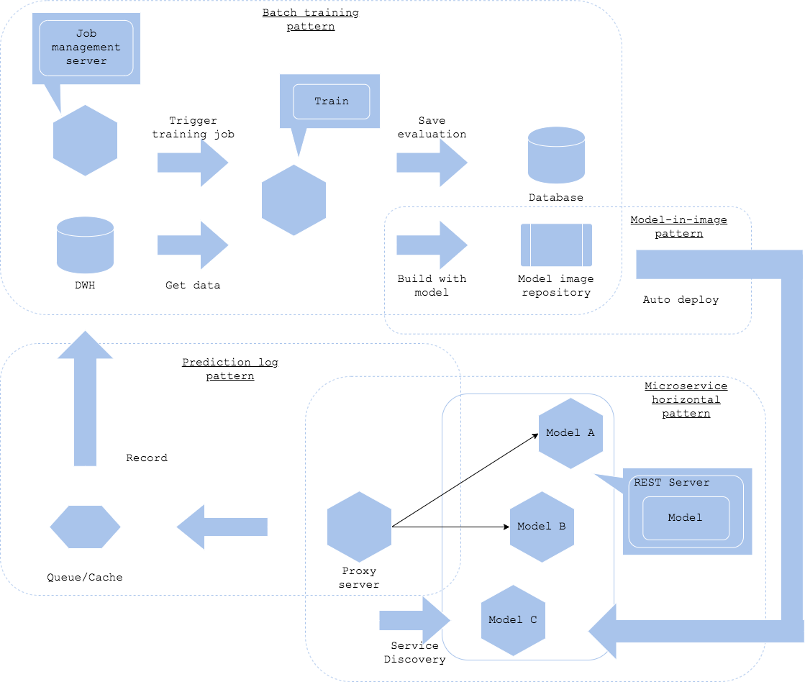

# Train-then-serve pattern

## Usecase
- 機械学習モデルを本番環境で使うためのワークフローをデザインしたいとき
- 学習とリリースを別のワークフローで実行したいとき
- 学習後にモデルを人手で評価し、リリース判定をしたいとき
- 学習したモデルを本番サービスにリリースし、評価したいとき

## Architecture
学習パイプラインと推論器のリリースを分かれたワークフローで実施したい場合、学習パターンとサービング・パターンを組み合わせた構成を取ることが可能です。本パターンでは学習後に人手でモデルや推論器のスピード等を評価し、リリース判定を実施することができます。ワークフローに人間による評価が入るため、頻繁にモデルをリリースするには向かない仕組みですが、確実なモデル評価を行うことが可能になります。 
学習と推論の間をつなぐ方法は[モデル・ロード・パターン](../../Operation-patterns/Model-load-pattern/design_ja.md)や[モデル・イン・イメージ・パターン](../../Operation-patterns/Model-in-image-pattern/design_ja.md)を利用することが可能です。いずれを選択するかはモデルと推論器の管理方針次第です。[モデル・ロード・パターン](../../Operation-patterns/Model-load-pattern/design_ja.md)であれば学習したモデルを既存の推論器の更新でリリース可能でしょうし、[モデル・イン・イメージ・パターン](../../Operation-patterns/Model-in-image-pattern/design_ja.md)であれば推論器自体の更新が必要になります。 
モデルを本番サービスに組み込む方法は[パラメータ・ベース・サービング・パターン](../../Operation-patterns/Parameter-based-serving-pattern/design_ja.md)が有効です。プロキシの環境変数にリリースしたモデルの推論器を登録することで、推論リクエスト先に追加することが可能です。サービス運営の観点で、[推論ログパターン](../../Operation-patterns/Prediction-log-pattern/design_ja.md)および[推論監視パターン](../../Operation-patterns/Prediction-monitoring-pattern/design_ja.md)は必須でしょう。 
サービング・パターンやQAパターンの選択は本番サービスの仕様次第ですが、実運用では複数のパターンの組み合わせになることが多いと思います。下図では[Webシングル・パターン](../../Serving-patterns/Web-single-pattern/design_ja.md)と[オンラインABテスト・パターン](../../QA-patterns/Online-ab-test-pattern/design_ja.md)の組み合わせにしています。オンラインABテストのログは[推論ログ・パターン](../../Operation-patterns/Prediction-log-pattern/design_ja.md)でDWHに登録し、再学習やモデル改善のためのデータセットにしていく構成になります。 
学習と推論モデルのリリースを分離する利点はリリース前にモデルの評価を行う余地がある点です。テストデータセットでの評価では受け入れテストとして不足するようなワークロードの場合、この構成を取ることができます。加えて、学習パイプラインの障害が推論モデルのリリースに直接的な影響を及ぼさないため、サービスとしての耐障害性も担保されます。逆に難点は、学習後に自動的に推論器がリリースされないため、モデルリリースの手間やリアルタイムな更新には不向きになります。

## Diagram

## Pros
- モデルのリリース前にマニュアルで評価可能。
- 学習パイプラインと推論サービスの障害やリソース、ワークフローを分離可能。

## Cons
- モデルのリリースにマニュアル実行が必要。

## Needs consideration
- 学習パターン、QAパターン、サービング・パターンの組み合わせ方法。
- モデルのリリース判定基準。
- モデルのリリース頻度。