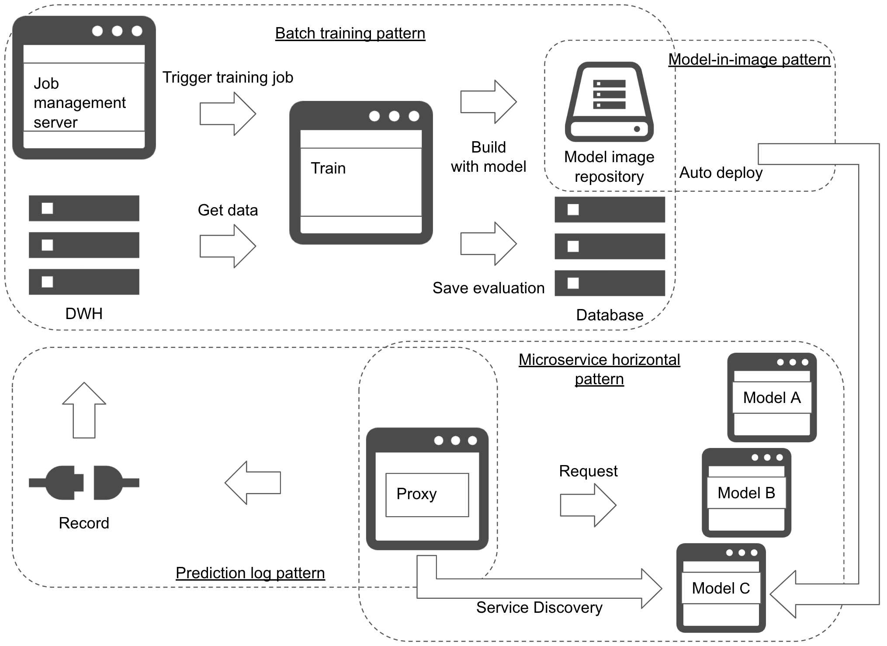

# Training-to-serving pattern

## Usecase
- To design end-to-end workflow of machine learning model into production.
- To release a model right after training.
- To automatically deploy a model into production.
- When your model training is stable enough.
- When you need to update models frequently.

## Architecture
When you want to design an architecture and workflow to connect training and serving, you will be combining the training patterns and serving patterns. If your require to deploy your model continuously with training pipeline, you can use the training-to-serving pattern. The aim of the pattern is to build the model server once the training completes and release automatically. If your usecase requires to udpate model frequently that manual evaluation is inoperative, then the pattern fits good. 
For the training pipeline, you may choose the [batch training pattern](../../Training-patterns/Batch-training-pattern/design_en.md) or the [pipeline training pattern](../../Training-patterns/Pipeline-training-pattern/design_en.md). It is a bit risky to select the [parameter and architecture search pattern](../../Training-patterns/Parameter-and-architecture-search-pattern/design_en.md) for its trained model quality may not be stable. 
It is possible to use the [model load pattern](../../Operation-patterns/Model-load-pattern/design_en.md) or the [model-in-image pattern](../../Operation-patterns/Model-in-image-pattern/design_en.md) to connect between the training and serving. Criteria of selecting which one depends on how you like to manage model and prediction server. If you want to update the model without change in the current server, you may choose the [model load pattern](../../Operation-patterns/Model-load-pattern/design_en.md), while you need to update the whole server for the [model-in-image pattern](../../Operation-patterns/Model-in-image-pattern/design_en.md). 
It may be good to use the [microservice horizontal pattern](../../Serving-patterns/Microservice-horizontal-pattern/design_en.md) for serving. The pattern aims to deploy a new prediction server parallelly to the others, and the proxy discovers the new service to be added to the prediction target. 
For sake of service management, it is mandatory to use the [prediction log pattern](../../Operation-patterns/Prediction-log-pattern/design_en.md) and the [prediction monitoring pattern](../../Operation-patterns/Prediction-monitoring-pattern/design_en.md). 
It is possible to release a model right after training. Note that it is necessary to have the model training and evaluation be stable that their quality will not get affected easily, and their pipeline be available. If the quality of trained model varies so often, the pattern will be risky. If the pipeline is not stable, then the whole workflow would be unstable. It is also important to consider if all the model should be in production. If a model is not necessary or useless in any reason, say out of date or performance degradation, you need to eliminate the one. It is simple to operate if it is possible to remove a prediction server on time elapsed, though there may be a chance that a model still in use may be removed. On the other hand, it is smarter if it possible to evaluate the production model regularly to outdate one, though the operation may be complex with taking other risk of managing the evaluation.

## Diagram

## Pros
- Release right after training.
- Frequent release.

## Cons
- Requires training pipeline, auto release, and service discovery.
- Not suitable for unstable training.

## Needs consideration
- Stabilize training, automate pipelines and requires service level on each phase.
- Service discovery and removal policy for serving.