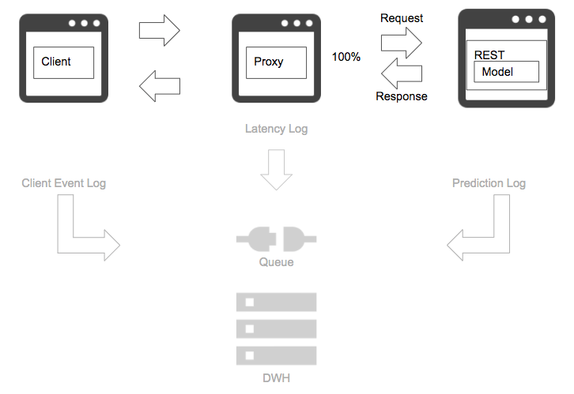

# No logging pattern

## Case
- Not taking log or profile.

## Situation
Not only for a machine learning system, but system in general, taking log is very important for operation and improvement. Without log in production system, you cannot fetch error, troubleshoot and improve your environment, that makes the system blackbox. Especially for a machine learning system, tracing inference result to related event logging will enable system and model improvement as well as business planning.  
An interesting and challenging part of working with machine learning is that machine learning in nature is tightly related to business scheme or user experience. Making a prediction to lead to an action or automation in sophisticated manner is something that traditional if-else statement is difficult to realize, and machine learning can challenge. Note that influencing business or user behavior, or even physical world, requires fit to the actual environment, which needs traceability from the model and system.

## Diagram

## Pros
- You don't have to pay for log storage.

## Cons
- You cannot operate and improve your system.

## Work around
- At least, get logs of fatal, error, warning and info levels.
- Define traceable event logs and implement.

## Related design pattern
- [Prediction log pattern](./../../Prediction-log-pattern/design_en.md)
- [Prediction monitoring pattern](./../../Prediction-monitoring-pattern/design_en.md)