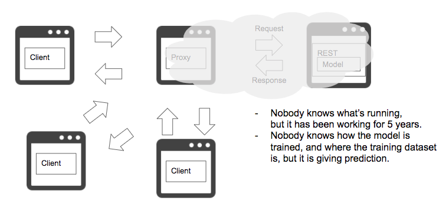

# Nobody knows pattern

## Case
- A machine learing system is running in production, but the machine learning engineer, software engineer or operator has left the project, and nobody knows what the system is working for.
- You can change a code, model and configuration without anybody's review.

## Situation
Not only for a machine learning system, but for all the systems, it is a horror when nobody knows how it is working. It is a remedy if the system is running independently without any dependents and no business impact, but the condition that "nobody knows" means that you cannot assure it is actualy independent, and in the worst case, all of your services stop all the sudden. 
On the other hand, there is less probability that the same members are assigned to one same project. With some private or organizational reasons, some people may leave the project. However, business and system work independent from personal reasons. You can seldom stop your production system because one engineer left the company. You need to implement business continuity with considering risks of what would happen, and it is sharing and documenting of model logic, dataset, versioning, code and environmental configuration in a perspective of machine learning system. You may be able to understand your software with reading its source code, though machine learning model and training dataset cannot be reproduced if it is not stored and managed. 
The "nobody knows" pattern may occur not only on member's retirement. Let's suppose you are using a machine learning model in IoT system with thermometer device logs. This condition may be in factory or in your room. You can measure temperature in Celsius, Fahrenheit and Kelvin. The United States commonly use Fahrenheit, Japan uses Celsius, and science uses Kelvin. Converting Celsius to Fahrenheit changes numerical range, such that 0 degrees Celsius is 32 degrees Fahrenheit, and 100 Celsius is 212 Fahrenheit. If you need to change the unit measurement of your thermometer from Celsius to Fahrenheit, or to Kelvin, you have to change the unit in your machine learning model to predict accurately. You may be able to detect the anomaly for Celsius to Fahrenheit change, for the values change apparently, but what if it is change from meter to yard in distance. 1 meter is 1.09 yard, and this little change may not be detected even by humans. Using physical device or sensor in machine learning system is common in a certain industry, and changing the device configuration may be ignorant to impact on machine learning, as a "nobody knows" pattern.

## Diagram

## Pros
- Troubleshooting manias may have exciting moments.

## Cons
- Difficulty in operating machine learning system.
- Prediction may be erroneous.

## Work around
- Avoid depending on a person.
- Include measurement unit sensing.

## Related design pattern
- [Prediction log pattern](./Operation-patterns/Prediction-log-pattern/design_en.md)
- [Prediction monitoring pattern](./Operation-patterns/Prediction-monitoring-pattern/design_en.md)
