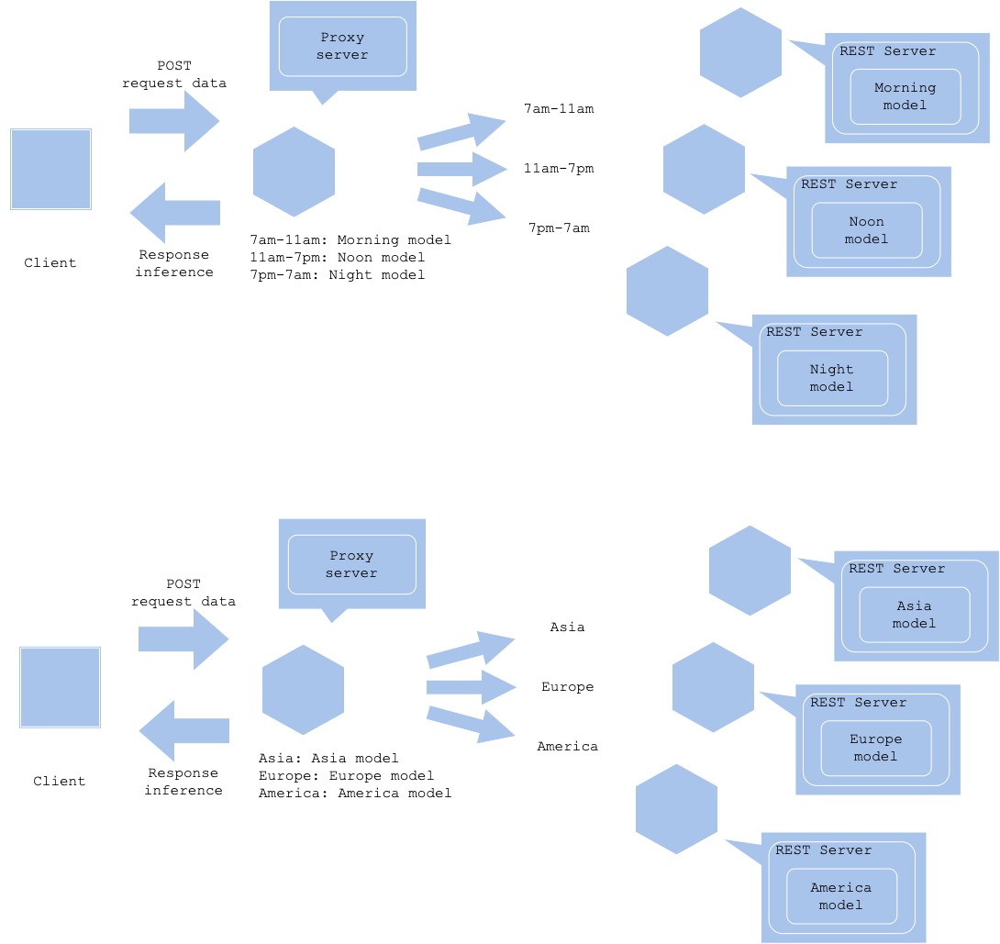

# Condition-based serving pattern

## Usecase
- 状況によって推論対象に大きな違いがある場合
- 複数の推論モデルをルールベースで使い分け可能な場合

## Architecture
状況ベース推論パターンは状況に応じて実行する推論器を出し分けるものです。ユーザの状況（時間や場所、ペルソナ等）に応じて適切な推論対象が変わることがあります。例えばおすすめのメニューを機械学習で推薦するユースケースの場合、朝の時間帯にステーキやワインを推薦することが適切とは限らないでしょう。またはカメラを用いてランドマーク分類をする場合、日本にいるのにカリフォルニア州にあるゴールデンゲートブリッジを推論することは極めて稀です。推論対象が適切かどうか、状況に応じて使い分けるのが状況ベース推論パターンです。 
状況ベース推論パターンでは各状況に応じてモデルを用意し、推論器としてデプロイします。各推論器へのアクセスはプロキシで制御します。時間帯によって出し分けるユースケースであれば、朝は朝専用モデル、昼は昼専用モデル、夜は夜専用モデルへリクエストします。モデル開発の難しさは各状況において問題空間や目的変数がどう変わるのか次第です。特徴エンジニアリングを共有できるのであれば目的変数のみを差し替えて学習することが可能です。状況によって特徴が大きく異なる場合は個別のモデル開発が必要になるでしょう。状況応じて過学習した推論モデルを用意することになるため、汎用的なモデルよりも適切な推論ができる、ということを期待したパターンになります。 
ただし、モデル数があまりにも多くなる場合、モデルの評価、改善や推論器の運用負荷が増大するため、状況ベース推論パターンで解決しようとしている課題が本当に本パターンや機械学習で解決すべきものなのか、コスト対効果から見直してみることも重要です。 
状況の分割方法は、状況に応じたデータの特徴と目的変数次第になります。場合によっては朝と夜で同じ推論モデルを使うことが適切、ということもあり得るでしょう。他方で人間の感覚から離れた状況分解をすると、システム的な運用ミスを招く可能性もあるため、注意が必要です。

## Diagram

## Pros
- 状況によって適切なモデルを提供することが可能。

## Cons
- モデル数に応じて運用負荷が増大する。

## Needs consideration
- 状況の分割方法。
- モデル数と運用負荷のバランス。

## Sample
https://github.com/shibuiwilliam/ml-system-in-actions/tree/main/chapter6_operation_management/condition_based_pattern