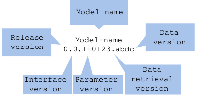
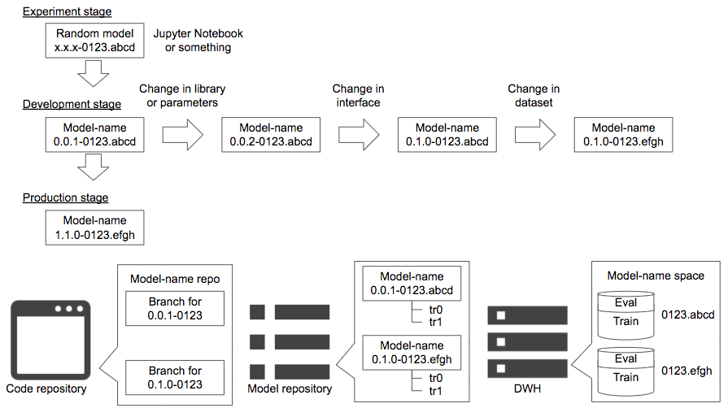

# [WIP]Data model versioning pattern

## Usecase
- データおよびモデルのバージョン管理をしたいとき（本番サービスで機械学習を使う全てのシチュエーション）

## Architecture
機械学習モデルのバージョニングは難しい。モデルを一つ作成し本番環境にデプロイするだけでも、その過程でバージョン管理される様々なコンポーネントが存在する。

- 機械学習の目的
  - 価値（株価予測、違反検知、顔認証等）
  - 機能（画像分類、回帰、ランキング等）
- リリースバージョン
  - 未リリース、リリース済み
- モデルの入力、出力インターフェイス
  - 入力値の型や形状
  - 出力値の型や形状
- コードまたはパイプライン
  - 学習コードまたは学習パイプライン
  - 推論コードまたは推論パイプライン
  - コードまたはパイプラインを動かすための言語、ライブラリ、OSとそれらのバージョン
- モデルのハイパーパラメータ
  - パラメータはライブラリやアルゴリズムの種類に依存する
- データ
  - データの取得方法
  - 分割された学習データと検証データ（とテストデータ）

再現性のある学習および推論を行うためには、これらをバージョン管理し、常に同じバージョンで再現実行できる必要がある。各コンポーネントは別々のレポジトリやDWHで管理されるため、それらの間で一意性のあるバージョニングを行うことが望ましい。 
バージョニングとして以下を推奨する。 
`model-name x.y.z-data.split` 

- モデル名（`MODEL-NAME x.y.z-data.split`）：モデルの名称
- リリースバージョン（`model-name X.y.z-data.split`）：リリース時のバージョン
- インターフェイスバージョン（`model-name x.Y.z-data.split`）：入出力インターフェイスのバージョン
- ロジックバージョン（`model-name x.y.Z-data.split`）：アルゴリズムやライブラリ、ハイパーパラメータのバージョン
- データ取得バージョン（`model-name x.y.z-DATA.split`）：データを取得する方法のバージョン
- データ格納バージョン（`model-name x.y.z-data.SPLIT`）：データを分割し補完したDWHに対するバージョン

#### モデル名（`MODEL-NAME x.y.z-data.split`）
モデルには名称を付けるべきだ。チーム内外でモデルの有無や特定ができない状態を避けるためにも、名前がない状態は避けるべきだ。また、名前があるほうが愛着もわきやすい。名称には価値（株価予測、違反検知、顔認証等）や機能（画像分類、回帰、リランキング等）を使うとわかりやすいが、チームで独自の命名基準があるのであれば、その基準で命名すれば良い。 

#### リリースバージョン（`model-name X.y.z-data.split`）
モデルのバージョンにはリリース前とリリース済みがある。リリース前は`model-name X.y.z-data.split`の`X`を0としておき、リリース時に1以上の値を入れる。 

#### インターフェイスバージョン（`model-name x.Y.z-data.split`）
機械学習のモデルは入力データに対して推論結果を出力する。用途や内部のアルゴリズムに違いがあるとしても、入力データに対して推論結果を出力する方式は普遍的である。入出力の形式が変わると外部インターフェイスも同時に変更が必要になるため、インターフェイスをバージョン管理し、外部システムとバージョンを一致させると良いだろう。各インターフェイスの型や形式はコードレポジトリで管理される。外部向けにはSwaggerやProtocol BufferでAPI定義を公開すると良いだろう。インターフェイスバージョンでは入出力の方式のみを定義し、内部のアルゴリズムやライブラリ、モデルの評価値は管理しない。アルゴリズムやライブラリはロジックバージョンで管理される。モデルの評価値はモデルのバージョン管理とともにモデルレポジトリ等で管理すると良い。インターフェイスバージョンは0から始まり、入力または出力を変えるごとに数値をインクリメントし、インターフェイス定義を一意のバージョンに一致させると良い。

#### ロジックバージョン（`model-name x.y.Z-data.split`）
機械学習の学習や推論ロジックには各種前処理やアルゴリズム（線形回帰、ロジスティック回帰、SVM、CNN等）、最適化手法や損失が用意されているが、その実行方法は各種言語やライブラリによって異なり、チューニング可能なパラメータも多様である。ロジックバージョンはインターフェイスの変更を伴わない前処理、アルゴリズム、ライブラリ、パラメータの選択を司る。これらの変更は多くの場合、コードレポジトリのブランチとして管理される。アルゴリズムやライブラリ、パラメータの選択はモデル開発の実験段階で多種多様に検証されるが、その全てをバージョン管理する必要はない（全てをバージョン管理するとなると、数十以上のバージョンができあがるだろう）。モデルの評価がチームレビュー可能になった時や、レビュー済みモデルを改善できた時にバージョニングすれば良いだろう。 
同じアルゴリズムやパラメータでも、学習によってモデルの評価値（損失）にばらつきが発生する場合がある。その場合はモデルレポジトリで学習をバージョニングする。学習によるばらつきはアンコントローラブルであるため、モデルとしてバージョン管理するのではなく、学習とその評価値として管理する。

#### データ取得バージョン（`model-name x.y.z-DATA.split`）、データ格納バージョン（`model-name x.y.z-data.SPLIT`）
データは一般的にDWHで管理される。学習で使用するデータは学習時に確定するため、データを学習データ、検証データ（とテストデータ）を分割した状態で記録しておくと良いだろう。データのバージョン管理で重要なのは、同じデータを取得できることと、学習データと検証データが混在しないこと（つまり、正常にモデルを評価できること）である。データは取得方法と分割された状態の両方をバージョン管理し、再取得可能にしておくことを推奨する。同時に、取得したデータは任意の環境に保存しておくことで、同じデータでの学習や評価を再現可能にしておくと良いだろう（構造化データであればテーブル形式で保存し、非構造化データであればzip等で固めてオブジェクトストレージやファイルストレージに格納しておくと良いだろう）。 
データのバージョン管理には取得方法のバージョン（`model-name x.y.z-DATA.split`）と分割データのバージョン（`model-name x.y.z-data.SPLIT`）が必要である。それぞれは数値バージョンではなく、文字や数値、記号を用いた名称にすると良いだろう。取得日時を用いても良い。取得方法（SELECT文やData pipeline定義）はGithub等コードレポジトリで管理するが、分割データは格納場所で管理する。 

---

インターフェイスやロジック、データ取得はプログラムに定義されるものになるため、コードレポジトリ（GithubやGitlab等）で管理される。ブランチによってバージョニングすれば、コードレポジトリのワークフローとモデルのバージョンを一致して管理することができる。 
出力されたモデルファイルとその評価（および学習）はモデルレポジトリで管理すると良いだろう。モデルレポジトリのサービスやソフトウェアは存在するが、現状ではスタンダードなものは存在しないため、バージョニングのワークフローは利用するソフトウェアの仕様に合わせることになる。 
取得し分割したデータは各種DWHやストレージに格納する。バージョンはデータ名（テーブル名やストレージのバケット名）で管理すると汎用性が高い。

## Diagram
### Versioning

### Version control in each stage

## Pros
- モデルのバージョンを管理することが可能。
- モデル学習を再現可能にするための各種コンポーネントを管理可能。
- 再現検証や更新管理等が可能。

## Cons
- コードレポジトリ、モデルレポジトリ、DWHと複数の環境でコンポーネントが管理される。

## Needs consideration
- 各種レポジトリやDWHの選択。
- レポジトリ、DWHの使用方法。