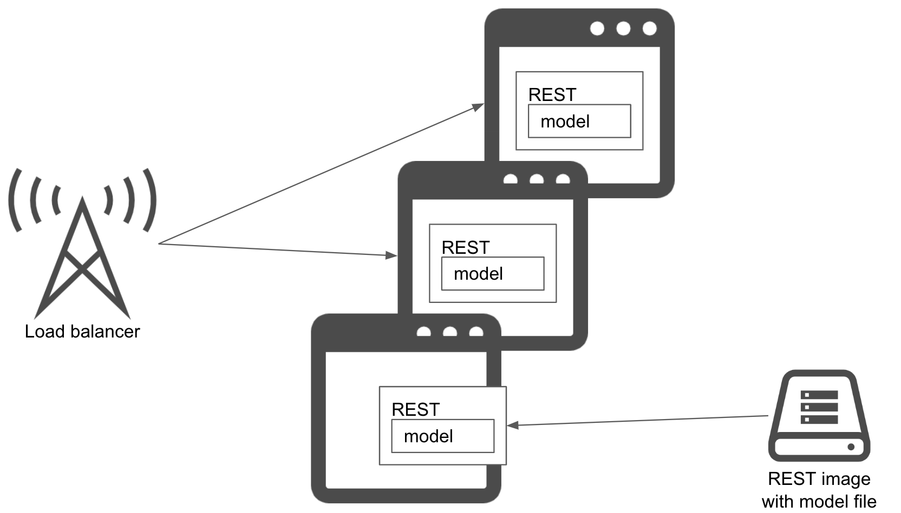

# Model-in-image pattern

## Usecase
- When you want to unify versions of service environment and prediction model.

## Architecture
While productionizing an ml service on a cloud platform (or on containers) becomes a common practice, it is still an important consideration to manage and version machine learning model along with its server image. The easiest way to do so is by including the model file into the server or container image. In the model-in-image pattern, you build a server or container image with the model file contained in it. This aligns the model training and image building in one workflow. This also makes the image version and model version unique, this way their version alignment with each other is not lost. 
You build your image after the model training completes. To deploy the prediction service, you can then pull and run the image on the production platform. 
A difficulty of the pattern is that the image building latency tends to get long and image size increase. Since the image building starts once the training completes, you will want to make a workflow for this to go through without any errors or recoverables. Also its deployment time will be long as downloading an image takes long because of the image size.

## Diagram

## Pros
- Uniquely identify a server image with model file version.

## Cons
- You need to define a complete pipeline of a model training and image building.
- Takes longer to build image and deploy.

## Needs consideration
- Pipeline definition.

## Sample
https://github.com/shibuiwilliam/ml-system-in-actions/tree/main/chapter3_release_patterns/model_in_image_pattern
