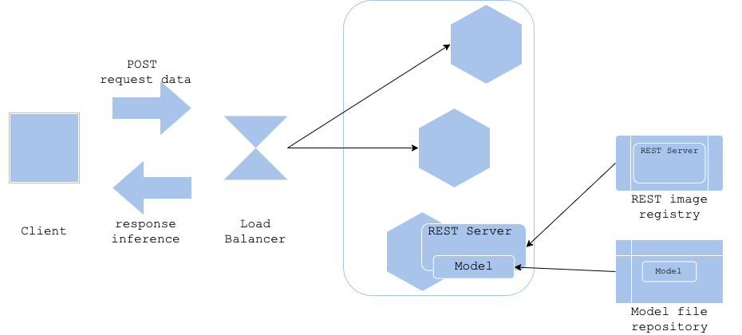

# Model load pattern

## Usecase
- サーバイメージのバージョンよりも推論モデルのバージョンを頻繁に更新する場合
- 同一サーバイメージで複数種類の推論モデルを稼働させる場合

## Architecture
クラウドやコンテナによってサーバイメージを使ってサーバを稼働させることが一般的になりましたが、機械学習の推論器としてサーバイメージと推論モデルファイルの管理方法やバージョニングは重要な検討課題です。サーバイメージと推論モデルファイルを分けて管理することによって、サーバイメージの構築（およびライブラリのバージョニング）とモデル学習を分離することができます。モデル・ロード・パターンでは推論サーバのイメージ構築とモデル学習の保存を別に実行することによって、サーバイメージを軽量にすることが可能になります。同時にサーバイメージの汎用性を高め、同一イメージを複数の推論モデルに応用することができます。複数の用途で同一のサーバイメージを利用する場合にこのパターンは有効です。 
モデル・ロード・パターンでは推論サーバを配備する際、サーバイメージをPullした後に推論サーバを起動し、その後にモデルファイルをロードして推論サーバを本稼働させます。モデルファイルのロード元を変数等で変更することによって、推論サーバで稼働するモデルを柔軟に変更することも可能です。 
このパターンの難点は、推論モデルがライブラリのバージョンに依存する場合、このパターンではサーバイメージのバージョン管理とモデルファイルのバージョン管理（サポートするライブラリのバージョン管理）を行う必要があることです。サーバイメージとモデルファイルのサポート表等が必要になるため、サーバイメージとモデルファイルが増え、複雑になっていくに従って、運用負荷が増大する可能性があります。

## Diagram

## Pros
- サーバイメージのバージョンとモデルファイルのバージョンを分離することが可能。
- サーバイメージの応用性が向上。
- サーバイメージが軽量になる。

## Cons
- 推論サーバの起動に時間がかかる可能性がある（サーバの配備とモデルファイルのロードが順番に行われるため）。
- サーバイメージとモデルファイルのバージョニングが必要。

## Needs consideration
- サーバイメージとモデルファイルのバージョニング方法および依存関係の管理。

## Sample
https://github.com/shibuiwilliam/ml-system-in-actions/tree/main/chapter3_release_patterns/model_load_pattern