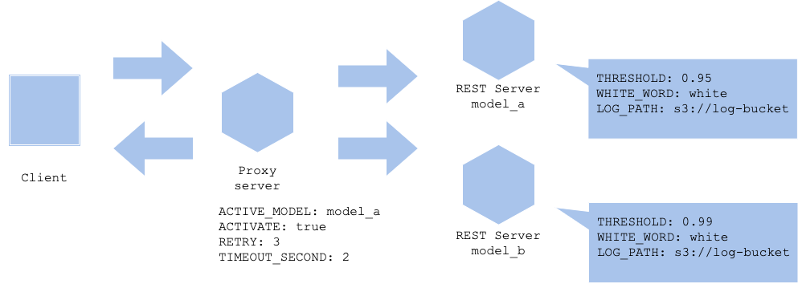

# Parameter-based serving pattern

## Usecase
- 파라미터를 사용하여 예측을 제어하고 싶은 경우.
- 룰 베이스로 제어가 가능한 경우. 

## Architecture
일반적으로 학습된 모델의 경우 파라미터가 고정되어 있기 때문에, 학습 후 개별적으로 파라미터를 수정할 수 없습니다. 하지만 모델이 항상 비지니스 로직이나 시스템 조건에 부합한 것은 아닙니다. 예를 들어, 실제 운영이 되고 있는 모델이 어떠한 이유로 비즈니스에 부정적인 영향을 미치는 경우, 모델을 업데이터 하거나 서비스에서 제거해야 하는 경우가 있을 수도 있습니다. 만약 재학습에 시간이 오래 걸린다면, 우선 일시적으로 제거하는 경우들이 있을 수 있습니다. 혹은 특정 입력 데이터에 대해서만 이상하고 다른 데이터에 대해서는 문제가 없을 수도 있습니다. 이 경우, 예정대로 모델을 다시 학습시키거나, 특정 데이터에 대해서는 예측하지 않는 로직을 사용할 수도 있습니다. 실제 서비스에 머신러닝을 이용할 경우, 높은 정확도의 결과로 좋은 비지니스 영향을 주는 것은 항상 있는 것이 아니며 일부 케이스나 시스템적인 이슈가 있는 경우를 고려하여 룰 베이스로 대처가 필요한 경우가 있음을 고려해야 합니다. 
이러한 경우를 대비하여, 예측의 일부 혹은 전체를 정지시키거나 재시도하거나 타임 아웃시킬 수 있는 등의 동작을 변경시킬 수 있는 장치를 코드에 넣어두면 유용하게 사용할 수 있습니다. 이러한 제어를 하기 위해 실행 명령어의 인수를 사용하거나, 컨테이너 어플리케이션이라면 환경 변수를 이용할 수도 있습니다. 모든 케이스와 입력값에 대해 오류 없이 높은 정확도를 유지하기는 어렵기 때문에, 룰 베이스의 장치를 이용하여 이상 징후를 예측하고 제어하는 것이 안정적으로 운영할 수 있는 방법입니다. 그렇다 하더라도, 모든 이상을 룰 베이스만으로는 커버할 수 없습니다. 최악의 경우를 막기 위해 `Activate` 혹은 비활성화 변수를 만들어 모든 예측을 멈출 수 있도록 하는 것이 좋습니다.

## Diagram

## Pros
- 엣지 케이스에 대한 비정상적인 예측을 피할 수 있습니다. 

## Cons
- 모든 케이스를 커버할 수는 없습니다. 
- 룰이 늘어남에 따라 운영의 복잡도가  올라갈 수 있습니다. 

## Needs consideration
- 어떠한 케이스를 어떤 변수로 제어 가능할지.  

## Sample
https://github.com/shibuiwilliam/ml-system-in-actions/tree/main/chapter6_operation_management/paramater_based_pattern
