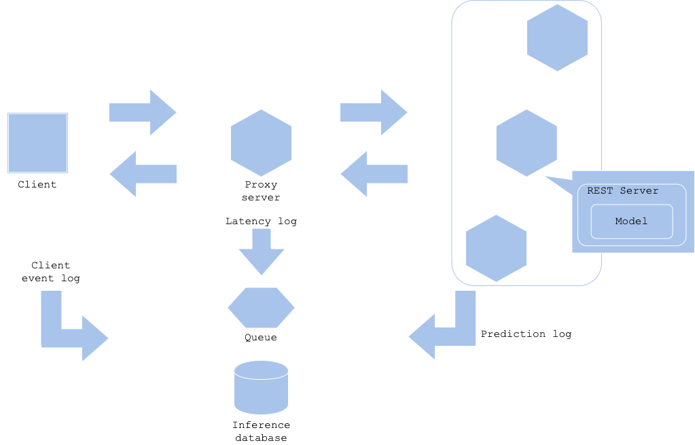

# Prediction log pattern

## Usecase
- To use prediction, latency, and other logs for improving your service.
- If you have a concern of amount of log to record on your DWH.
- To monitor and send alert with log.

## Architecture
It is mandatory to collect log to analyze and improve your service. The log may include prediction result along with input, latency, client event, and related activities. Even though each log may be produced in each system component, it is reasonable to record them in one DWH. Using queue to aggregate log may reduce overload to DWH without losing logs, while you may need to consider if the log processing takes so long that affects freshness of the log. 
Log is useful in many aspects. For instance, if the prediction or user behaviour is unexpected, or changed drastically from past, then you may assume there is some anomaly in a workflow. It is better to send an alert in such case to analyze anomaly and resolve it. There may be a chance that input data format changes with a little change in client code. If you can observe a system outage with that change, that is rather fortunate case. The model serving may predict without error, but with erroneous prediction. To filter such cases, it is good to have an alert for the prediction system as well as the model prediction log.

## Diagram

## Pros
- Able to analyze effect of prediction.
- Alert.

## Cons
- Amount of log may increase cost.

## Needs consideration
- Log frequency and log level.
- Storing frequency and backup.
- Purpose of analysis.

## Sample
https://github.com/shibuiwilliam/ml-system-in-actions/tree/main/chapter5_operations/prediction_log_pattern