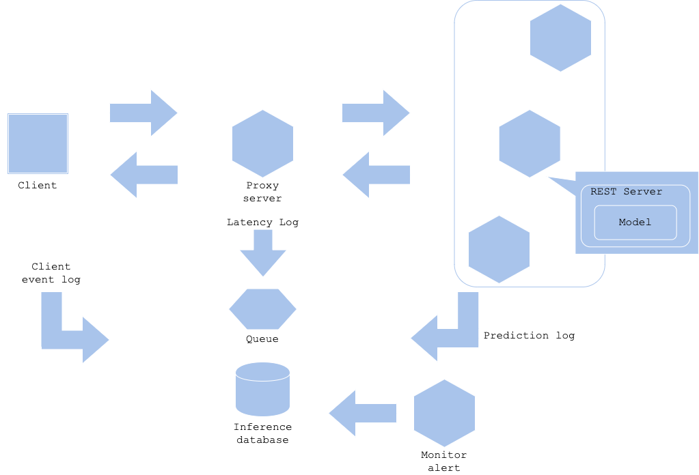

Prediction monitoring pattern

## Usecase
- 推論結果を監視し、推論傾向が異常な場合に通報したいとき
- 推論の値や集計が想定された範囲内にあることを担保したいとき

## Architecture
インフラやアプリケーションのログを監視し通報することは運用上必要なシステムになります。推論結果についても同様に監視したほうが良い場合があります。特に本番サービスやプロダクトに組み込まれている推論器や、推論結果にサービスレベル目標が定められている推論器の場合、推論傾向を監視することが求められます。 
推論監視パターンでは推論器に注目して監視、通報を行います。推論結果の正常性が疑わしい状態には以下のようなものがあります。

- 通常であれば発生する推論結果が一定時間発生しないとき（または滅多に発生しない推論結果が高頻度で発生するとき）。例：異常検知システムにおいて高頻度で異常が検知される場合。
- 一定時間内の推論数が通常と比較して異常に少ないとき（または多いとき）。例：100rpsのサービスで推論が1000rps発生する場合。Webサービスで一定時間推論が実行されない場合。
- 同じ入力データによる推論が連続して実行されているとき。例：特定の入力データでエラーになる推論でリトライが発生している場合。DDOS攻撃が実行されている場合。

いずれの状態においても、推論器の異常または外部システムの異常を切り分け、正常化する必要があります。そのためには異常な状態（または正常な状態）を定義し、監視・通報するシステムが必要になります。推論器の実行頻度にもよりますが、Webサービスであれば数回の推論で異常と判断することは稀です。一定時間の推論から、異常な傾向があると判断する必要があります。その場合、監視対象は推論器ではなく、ログを集約するDWHに対して定期的にクエリして監視すると良いでしょう。または推論を視覚化するダッシュボードを用意する方法もあります。 
監視・通報のレベルや頻度は推論器のサービスレベルや重要性次第です。大きなビジネス損失や人命に関わる推論器であれば、小さな異常でも高頻度で通報することになるかもしれません。その場合、運用担当者を24/365で配置する必要があります。逆に重要度の低いサービスであれば、日中のみの通報で、夜間は監視のみにしておくという体制も可能です。監視・通報に必要なのはサービスレベルに応じた運用方針になります。推論器やサービスの重要性を吟味し、体制を作ることが重要です。

## Diagram

## Pros
- 推論器の異常に気付き、遅滞なく修正や障害対応することができる。

## Cons
- 不要な監視・通報はコスト増の原因になる。

## Needs consideration
- 推論器のサービスレベル
- 監視・通報の頻度やレベル、通報先、体制
- 異常時の対応方法やマニュアル

## Sample
https://github.com/shibuiwilliam/ml-system-in-actions/tree/main/chapter5_operations/prediction_monitoring_pattern