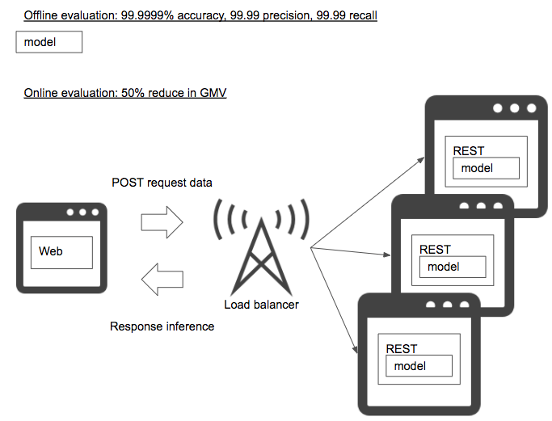

# Offline only pattern

## Case
- If your machine learning model is only evaluated with offline test data.

## Situation
A business value of a machine learning model can be proven when the model is implemented to your production service, and improves business KPI or contribute on efficiency. The model's utility can only be actually evaluated based on business, and it is not test data. The test dataset can be one of the criteria to decide releasing the model or not into production, but the test dataset is not business KPI. Even if your model scores 99.99% accuracy in a test dataset, you always have to reevaluate its actual impact in the business production environment to see if it makes improvement. If the model performs poor in the production, or make something worse, then it is recommended to decide shut down request to the model (with [Parameter-based serving pattern](../../../Operation-patterns/Parameter-based-serving-pattern/design_en.md)) to avoid anymore negative impact.

## Diagram

## Pros
- None.

## Cons
- You are not evaluating the model with your business impact.

## Work around
- Define KPI to be improved with the model in production, and analyse comparison of the prereleased state and released state (or A group and B group for A/B testing). Configure log definition to evaluate the model impact, and once enough logs are collected to evaluate the model, assess the model to decide continue using the model or not. If continued, then let's see how to improve the model.

## Related design pattern
- [Shadow AB-testing pattern](./../../Shadow-ab-test-pattern/design_en.md)
- [Online AB-testing pattern](./../../Online-ab-test-pattern/design_en.md)