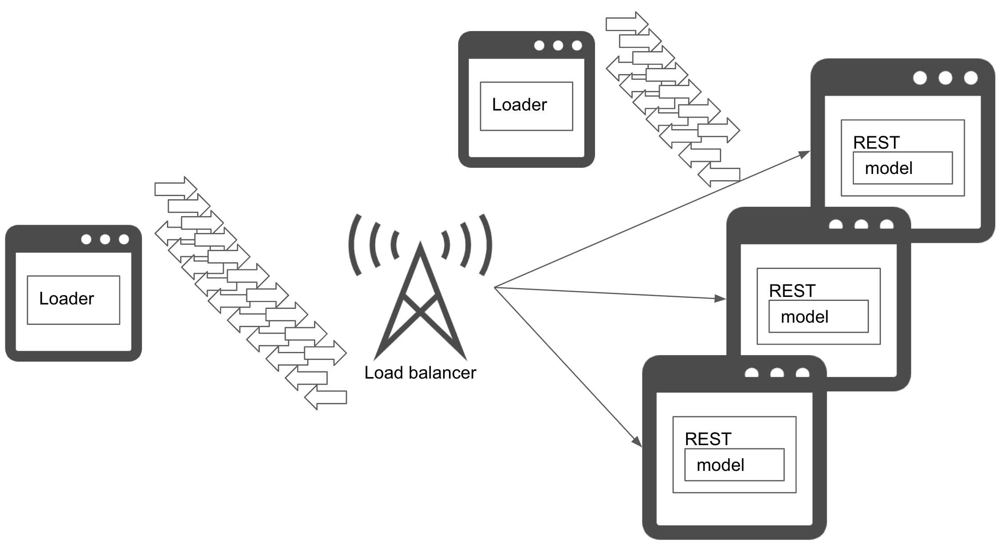

# Loading test pattern

## Usecase
- 예측 서버의 대기 시간을 측정하고 싶은 경우.
- 운영 환경에 필요한 리소스를 계획하기 위해 예측 서비스에서 부하 테스트를 실행하고 싶은 경우.

## Architecture
예측 서버의 대기 시간과 동시 연결 수는 서비스의 가용성에 직결되는 중요한 수치입니다. 아무리 좋은 머신러닝 모델을 만들어도 하나의 요청을 예측하는데 1분이 걸리거나 서버당 하나의 요청만 가능하다면 프러덕션 서비스에서 작동하지 않을 수 있습니다. 물론 대규모 리소스와 예측용 GPU를 사용해 플랫폼으로는 작업이 가능할 수 있지만, 비즈니스는 아닐 수 있습니다.  

Loading test pattern은 기존 웹 서비스나 온라인 시스템의 부하 테스트를 머신러닝 예측 서비스에 적용하는 패턴입니다. 예측 서비스는 웹 또는 온라인 서비스의 한 형태이므로 동일한 방식으로 부하 테스트를 적용할 수 있습니다. 대부분 예측 서비스의 성능은 CPU에 의존적이기 때문에, 만약 서비스가 대기 시간 또는 가용성 요구 사항을 만족하기 힘든 경우 CPU 코어 또는 서버 수를 늘려야 합니다. 추가로 만약 파이썬으로 예측 서버를 구축하는 경우, 파이썬은 하나의 프로세스에 하나의 쓰레드만 사용하는 GIL(Global Interpreter Lock)의 제약을 받기 때문에 리소스를 효율적으로 사용하지 못할 수 있습니다. 이런 경우 멀티프로세싱, wsgi 또는 asgi 사용해서 동시성을 늘려야 합니다.  

부하 테스트를 위한 입력 데이터의 종류를 고려하는 것도 중요합니다. 일부 예측은 이미지, 소리, 영상 또는 텍스트를 사용할 수 있으며 이런 데이터들은 보통 크기가 큰 경향이 있습니다. 운영 환경에서 입력 이미지의 크기가 무작위인 경우 다양한 픽셀 및 비율로 입력 데이터 크기를 무작위로 시뮬레이션하는 것이 좋습니다. 이런 입력 데이터는 전처리 과정에서 관리될 수 있으며, 입력 데이터가 너무 커서 메모리에 로드할 수 없는 경우 메모리 부족 오류로 인해 서버가 중지될 수 있습니다. 이 경우 전처리를 재구성하거나 입력 데이터의 사이즈를 제한해야 합니다.  

로드 밸런서, 네트워크, 프록시 또는 로드 테스트 환경에 병목 현상이 있을 수 있습니다. 필요한 대기 시간과 가용성을 달성할 수 없는 경우 부하 테스트에 사용 중인 리소스를 검토하는 것이 좋습니다.

## Diagram

## Pros
- 운영 환경에 대한 리소스를 계획하기 위해 대기 시간과 동시 연결 수를 측정할 수 있습니다.
- 운영 서비스에 들어가기 전에 트러블슈팅 스킬을 습득하고 병목 현상을 찾을 수 있습니다.

## Cons
- 비용.
- 모델 예측 속도 튜닝이 어렵습니다.

## Needs consideration
- 병목 현상 및 해결 방법.
- 다양한 데이터셋 준비를 추천합니다.
- 병목 현상이 모델 예측에 있는 경우 모델을 다시 개발해야할 수 있습니다.

## Sample
https://github.com/shibuiwilliam/ml-system-in-actions/tree/main/chapter6_operation_management/load_test_pattern
