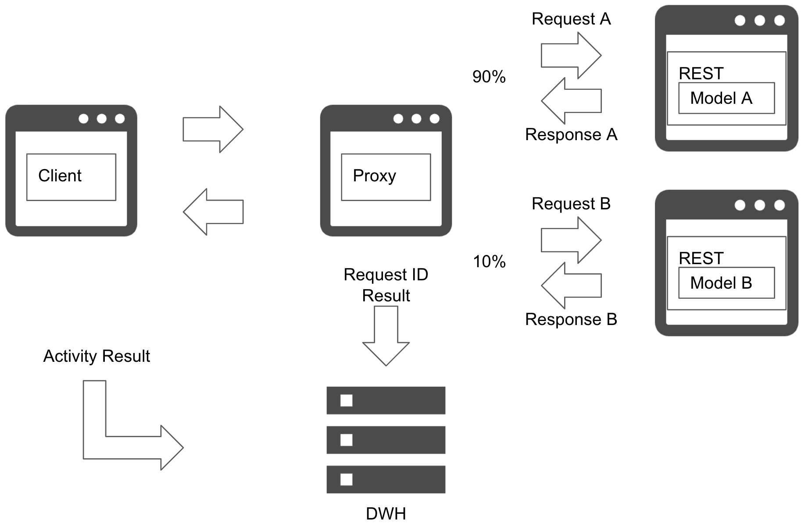

# Online AB test pattern

## Usecase
- 새로운 예측 모델이 운영 환경 데이터에서 문제없이 예측할 수 있는지 확인하고 싶은 경우.
- 새로운 예측 서버가 운영 환경 액세스 부하를 견딜 수 있는지 확인하고 싶은 경우.
- 온라인으로 여러 예측 모델의 비즈니스 가치를 측정하고 싶은 경우.
- 새로운 예측 모델이 현재의 예측 모델보다 나쁜 결과를 내지 않는 것을 확인하고 싶은 경우.

## Architecture
Online AB test pattern은 여러 예측 모델 및 예측 서버를 프러덕션 데이터에서 시험하는 방법입니다. 이 패턴은 여러 예측 서버를 병렬로 배포하고, 이들 간에 부하를 분산합니다. 현재 모델에 더 높은 부하를 유지하고 새로운 모델에 대한 액세스를 점진적으로 늘립니다. 로드 밸런싱은 프록시 서버에서 관리됩니다. 프록시 서버는 ID와 함께 요청 데이터 및 예측을 데이터 웨어하우스에 저장합니다. 새 모델의 영향을 비교하려면 클라이언트 이벤트 로그를 확인해야 할 수 있습니다. 목표에 따라 로드 밸런싱 규칙을 고려할 수 있습니다. 목표가 사용자 활동을 비교하는 것이라면 사용자를 동일한 모델에 할당하는 것이 좋습니다. 목표가 예측 결과를 기록하는 것이라면 무작위로 균형을 맞추거나 모든 예측에 요청을 보낼 수 있습니다.  

새로운 예측 모델의 예측 결과와 대기 시간, 가용성에 문제가 있는 경우 현재 서버에 액세스를 리턴시키고 새로운 예측 모델을 중지합니다. 새로운 모델의 유효성을 측정하는 기간은 검토가 필요합니다. 서비스가 시즈널리티가 존재하면 모델을 오래 테스트해야 하고, 만약 서비스가 매일 비슷하게 사용된다면 일주일 정도에 결과가 나올 것입니다. 한편 새로운 모델을 출시하자마자 즉시 결과를 아는 경우도 있습니다(주가 등 결과가 순차적으로 판명되는 경우). 새 모델이 현재 모델을 대체할 수 있는지는 예측 결과와 영향을 보고 결정하는 것이 중요합니다.  

Online AB test pattern은 새로운 모델을 프러덕션경시스템에 연결하고 예측 결과를 클라이언트에 반환합니다. 비즈니스 또는 사용자 경험에 영향을 미친다는 점을 유의하는 것이 중요합니다.

## Diagram

## Pros
- 새로운 모델의 예측 결과와 속도, 가용성을 프러덕션 서비스에서 확인할 수 있습니다.
- 여러 모델의 예측 결과를 수집하고 분석할 수 있습니다.

## Cons
- 새로운 모델이 부정적인 비즈니스 영향을 미칠 수 있습니다.
- 새로운 예측 서버에 대한 추가 비용이 발생합니다.

## Needs consideration
- 부하 분산 정책.
- 새 모델을 사용할지 말지에 대한 평가 방식 및 판단 기준이 필요합니다.

## Sample
https://github.com/shibuiwilliam/ml-system-in-actions/tree/main/chapter6_operation_management/online_ab_pattern
