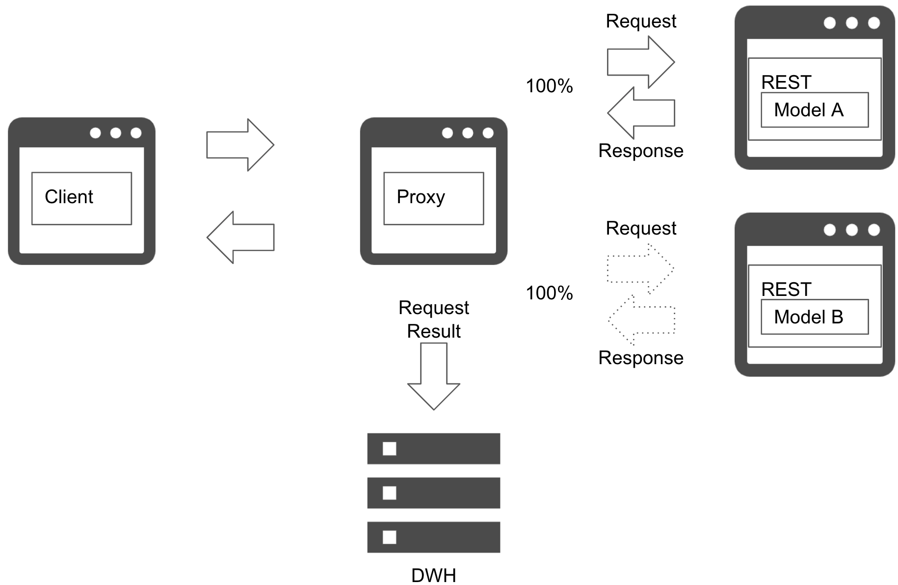

# Shadow AB test pattern

## Usecase
- 새로운 예측 모델이 운영 환경 데이터에서 잘 동작하는지 확인하고 싶은 경우.
- 새로운 예측 서버가 운영 환경 부하를 견딜 수 있는지 확인하고 싶은 경우.

## Architecture
Shadow AB test pattern은 여러 예측 모델 및 서버를 운영 환경 데이터를 사용해 검증하는 아키텍처입니다. 이 패턴은 여러 예측 서버를 배포하고 모든 서비스에 예측 요청을 전송하며 예측 응답은 현재 모델에만 보냅니다. 따라서 새로운 모델의 예측은 클라이언트에 전송되지 않습니다. 프록시 서버는 예측 모델의 프로필과 모든 예측 결과를 데이터 웨어하우스에 저장합니다. 새로운 모델의 품질을 확인하기 위해 클라이언트 환경에 영향을 주지 않고 예측 결과와 대기 시간을 측정하고 실전 도입 여부를 판단합니다.  

새로운 모델에 문제가 발생할 경우 예측 서비스는 운영 환경에 배포하지 않고, AB 테스트에서 제거됩니다. 새로운 모델의 유효성을 측정하는 기간은 검토가 필요합니다. 서비스가 시즈널리티가 존재하면 모델을 오래 테스트해야 하고, 만약 서비스가 매일 비슷하게 사용된다면 일주일 정도에 결과가 나올 것입니다. 한편 새로운 모델의 출시하자마자 즉시 결과를 아는 경우도 있습니다(주가 등 결과가 순차적으로 판명되는 경우). 새 모델이 현재 모델을 대체할 수 있는지는 예측 결과와 영향을 보고 결정하는 것이 중요합니다.  

Online AB test pattern과 달리, Shadow AB test pattern을 사용하면 적은 위험 부담으로 현재 모델과 새로운 모델을 비교할 수 있습니다. 반면 새로운 모델의 예측을 클라이언트에 반환하지 않기 때문에 비즈니스 영향을 측정하기 어렵습니다. Shadow AB test pattern에서 예측 모델이 문제없이 작동하는 것을 확인한 후, Online AB test pattern에서 비즈니스 가치를 측정하는 것을 추천합니다.

## Diagram

## Pros
- 운영 환경에 영향을 주지 않고 새로운 모델 성능을 확인할 수 있습니다.
- 여러 모델의 예측 결과를 수집하고 분석할 수 있습니다.

## Cons
- 새로운 예측 서버에 대한 추가 비용이 발생합니다.

## Needs consideration
- 새 모델을 사용할지 말지에 대한 평가 방식 및 판단 기준이 필요합니다.

## Sample
https://github.com/shibuiwilliam/ml-system-in-actions/tree/main/chapter6_operation_management/shadow_ab_pattern
