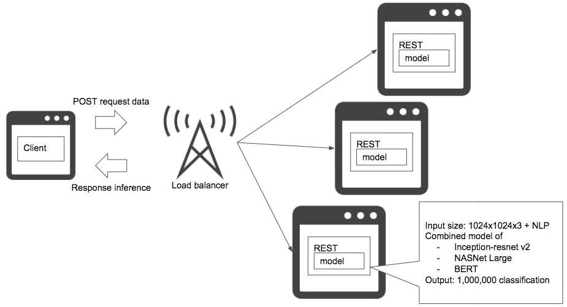

# All-in-one pattern

## Case
- 하나의 서버 또는 하나의 서버 그룹에서 여러 예측 모델을 실행하는 경우.

## Situation
하나의 제품에서 여러 예측 모델을 배포하고 싶은 경우가 있지만, 하나의 서버 또는 하나의 서버 그룹에서 여러 예측 모델을 실행하는 것은 추천하지 않습니다. 모든 모델을 단일 환경에서 실행하면 서버 비용을 줄일 수 있지만, 소프트웨어 개발, 트러블슈팅, 업데이트의 어려움으로 운영 비용이 증가할 수 있습니다.  

이 상황에서 모델 개발을 할 경우 라이브러리(환경) 선택에 제한이 생깁니다. 머신러닝을 위한 라이브러리와 알고리즘은 빠르게 변하고 있습니다. 다른 모델에 맞춰 모델을 개발하면 알고리즘 선택이 제한될 것이고, 아마 제일 좋은 알고리즘을 선택할 수 없을 수 있습니다.  

단일 아키텍처에서 장애가 발생하면, 근본 원인을 찾기 위해 모든 로그를 확인해야 할 수 있습니다. 시스템에서 결함을 분리하는 것이 어려워지고, 머신러닝 모델의 장애(정상적인 예측이 이루어지지 않은 상황)도 모든 로직을 확인해야 해서 복잡성과 문제를 해결하는 시간이 늘어납니다.  

시스템과 모델의 업데이트도 마찬가지로 복잡하고 오랜 시간이 필요합니다. 모델을 설치하는 방법에 따라, [Model in image pattern](../../../Operation-patterns/Model-in-image-pattern/design_ko.md) 또는 [Model load pattern](../../../Operation-patterns/Model-load-pattern/design_ko.md)를 사용할 수 있습니다. 이런 시스템의 업데이트는 모델 입장에선 불필요한 업데이트일 수 있습니다. 시스템 업데이트 및 모델 업데이트의 빈도는 일치하지 않는 경우가 많지만, 단일 시스템이라면 양쪽을 동시에 갱신하기 때문에 운영 비용이 증가합니다.  

여러 모델을 운영하는 경우, 특별한 이유가 없다면 서버당 한 모델의 마이크로 서비스 아키텍처로 배포하는 것을 추천합니다.

## Diagram

## Pros
- 거의 합리적인 비용.

## Cons
- 개발과 운영 비용이 증가합니다.

## Work around
- 마이크로 서비스에서 서버와 모델을 단일 책임으로 개발합니다.

## Related design pattern
- [Prep-pred pattern](./../../Prep-pred-pattern/design_ko.md)
- [Microservice vertical pattern](./../../Microservice-vertical-pattern/design_ko.md)
- [Microservice horizontal pattern](./../../Microservice-horizontal-pattern/design_ko.md)
