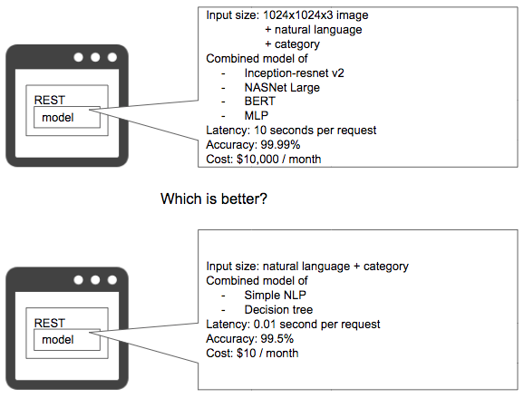

# Online bigsize pattern

## Case
- オンラインのサービスやリアルタイムな処理が必要なシステムで推論に時間を要するモデルを配備している状態。
- サービスの求めるレイテンシーと機械学習モデルが実現可能な推論時間が一致していない状態。
- 完了時間の決まっているバッチ処理で、推論数×推論時間が完了時間に間に合わない状態。

## Situation
Webサービスにせよバッチ処理にせよ、ひとつの処理を完了するのに求められる所要時間の要件があります。Webサービスであれば1リクエストに対して1秒以内にレスポンスするという要件になります。バッチ処理であれば夜間6時間で1億件のレコードを完了する、というものになります。いかなるビジネスやシステムにおいても、時間は有限かつ貴重であるため、1回の処理に長時間を費やすことはできません。機械学習の推論器を組み込んで稼働させる場合、推論器の所要時間がシステムの要件を満たすように開発する必要があります。特に複雑で頂戴なディープラーニングのモデルは計算量が膨大になるため、Webサービスでオンラインで稼働させることは難しくなるでしょう。スケールアウトやスケールアップで1サーバの処理量を減らして高速化することも可能ですが、1推論時間が要件を満たすことが条件になります。推論の処理時間を短縮するために推論用GPUを使うことも可能ですが、通常のCPUよりコストが割高になります。シンプルなモデルで推論速度を向上することも可能ですが、Accuracy等の評価値が複雑なモデルよりも低くなる可能性もあります。 
モデルの評価vsスピードのバランスに正解はありませんが、どういう推論とスピードであればビジネスやシステム要件を満たすのか、モデル開発と共同してサービスレベルを定めることが肝要です。

## Diagram

## Pros
- 長大で複雑なモデルのほうが機械学習の評価値は良くなることが多い。
- 複雑なモデルを作るのは楽しい。

## Cons
- スピードとコストが犠牲になる。
- シンプルでリーズナブルなモデルを作るのも楽しい。

## Work around
- 推論機の評価値と同時に、ビジネス的またはシステム的に求められる処理時間やスピードを定義し、それら要件を満たすモデル開発を行う。
- コストが許すのであればスケールアウトやスケールアップ、GPUの利用等を検討する。

## Related design pattern
- [Prediction cache pattern](./../../Prediction-cache-pattern/design_ja.md)
- [Data cache pattern](./../../Data-cache-pattern/design_ja.md)
- [Loading test pattern](./../../../QA-patterns/Loading-test-pattern/design_ja.md)
- [Prediction log pattern](./../../../Operation-patterns/Prediction-log-pattern/design_ja.md)
- [Prediction monitoring pattern](./../../../Operation-patterns/Prediction-monitoring-pattern/design_ja.md)