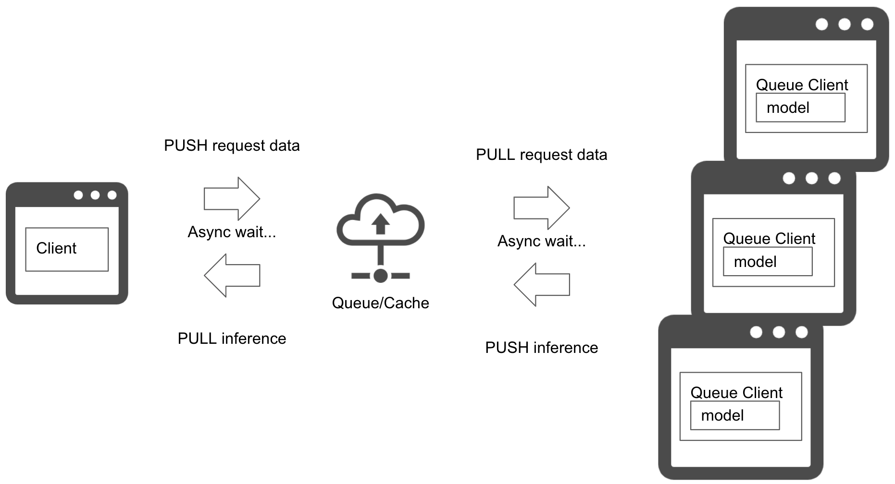
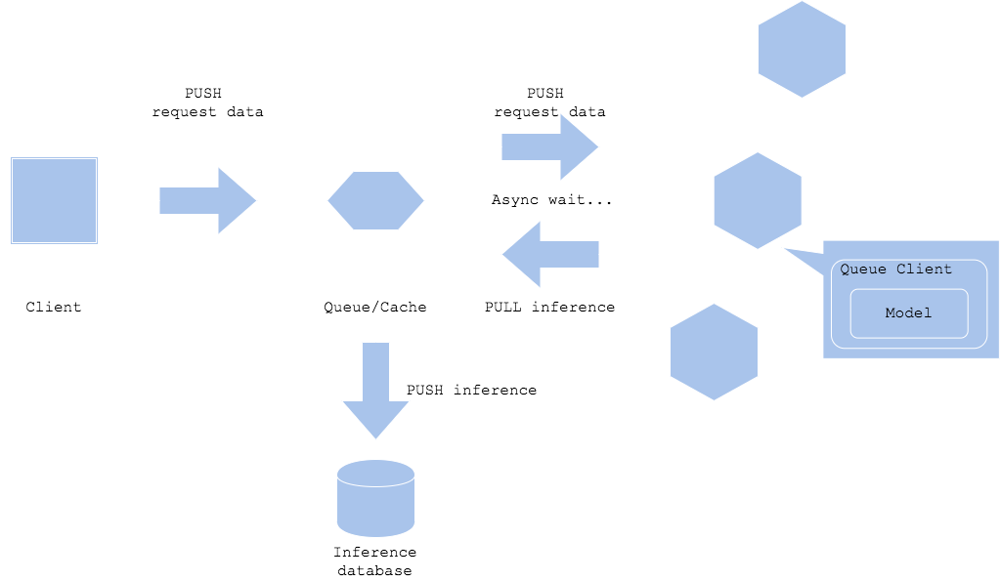

# Asynchronous pattern

## Usecase
- When the immediate process does not depend on the prediction.
- To separate the client which is making the prediction request and the destination where response is expected.

## Architecture
The asynchronous pattern realizes separation of a prediction request and prediction retrieval with placing queue or cache in between the client and predictor. It will allow the client to not to wait for the inference latency. In order for the client to get the prediction, you have to add poling to pull the result from the queue. If you want the prediction result to be retrieved by a resource other than the client, like `Diagram2`, it can proceed to the next step without waiting for the prediction latency. 
In addition, both in case of `Diagram1` and `Diagram2`, you can make the prediction server to push the result to the other component, while you have to carefully consider its usecase for the system and workflow becomes quite complex.

## Diagram
### Diagram1

### Diagram2

## Pros
- You can separate client and prediction.
- The client does not have to wait for the prediction latency.

## Cons
- Requires queue, cache or similar kind of proxy.
- Not fit to real-time usecase.

## Needs consideration
- How to trigger prediction:
  - Queue: prediction will be FIFO
  - Cache: depends on existence of cache
  - PubSub: predictor's subscription to run prediction
- Needs consideration for prediction error:
  - If you need to retry, consider triggering retry in the prediction server or return to queue.
  - If the error is caused by data or programmatical issue, there may be a chance that the request keeps retrying until you manually disposes the request.
- Since the pattern does not support ordered predition, you have to consider the workflow if you need concrete order for input or event in the usecase.

## Sample
https://github.com/shibuiwilliam/ml-system-in-actions/tree/main/chapter4_serving_patterns/asynchronous_pattern