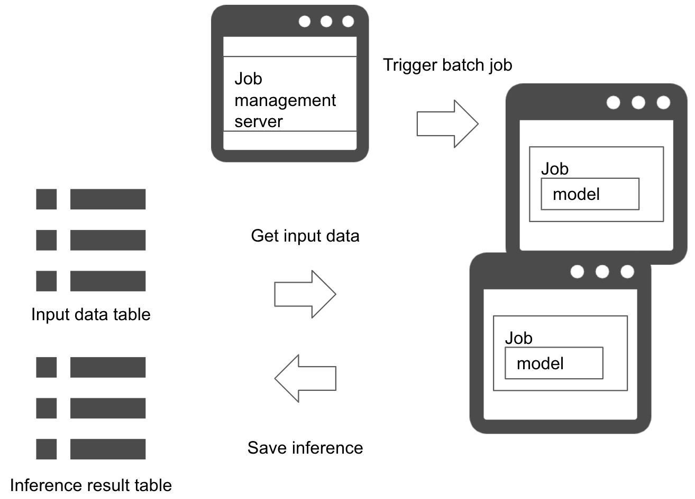

# Batch pattern

## Usecase
- リアルタイムまたは準リアルタイムで推論する必要がないとき
- 過去のデータにまとめて推論を実行したいとき
- 夜間、毎時、毎月等、定期的にデータを推論したいとき

## Architecture
推論をリアルタイムに実行する必要がない場合、バッチ・パターンで定期的に推論を行うことが可能です。バッチ・パターンでは溜まったデータを夜間等、定期的に推論し、結果を保存することができます。もちろん夜間実行である必要はなく、ユースケースによって1時間毎・1ヶ月毎の実行も可能です。バッチ・パターンではバッチ・ジョブを起動するジョブ管理サーバが必要になります。ジョブ管理サーバは決められたルール（時間や他の条件）をトリガーにして推論のバッチ・ジョブを起動します。推論サーバはバッチ・ジョブの起動時のみに稼働します。基盤にクラウドやKubernetesを使用している場合、サーバの停止・起動をコントロールすることでコスト最適化も可能になります。

## Diagram

## Pros
- サーバのリソース管理を柔軟に行うことが可能。
- 何らかの理由で推論に失敗しても再度推論することが可能。

## Cons
- ジョブ管理サーバが必要。

## Needs consideration
- 一回のバッチ・ジョブでどの範囲のデータを推論するか、ジョブの起動条件が必要になる。
- 推論結果を得るまでの期限が決められている場合、推論バッチ・ジョブの実行スケジュールや稼働する推論サーバ数を調整する必要がある。夜間バッチ等であれば、翌朝までに推論完了することが要件になる場合が多い。
- バッチ・ジョブが失敗したときの方針が必要がある。
  - 全件リトライ：失敗した場合は再度推論バッチ・ジョブを実行し、全件を推論する。
  - 一部リトライ：失敗したデータのみ再度推論する。
  - 放置：失敗してもリトライを起動せず、次のバッチ・ジョブで推論する。
- 毎月や毎年等、推論バッチ・ジョブを起動する時間が大きく離れる場合、機械学習モデルの有効性（Out-of-date）やサーバ自体の稼働可否をモニタリングする必要がある。

## Sample
https://github.com/shibuiwilliam/ml-system-in-actions/tree/main/chapter4_serving_patterns/batch_pattern
