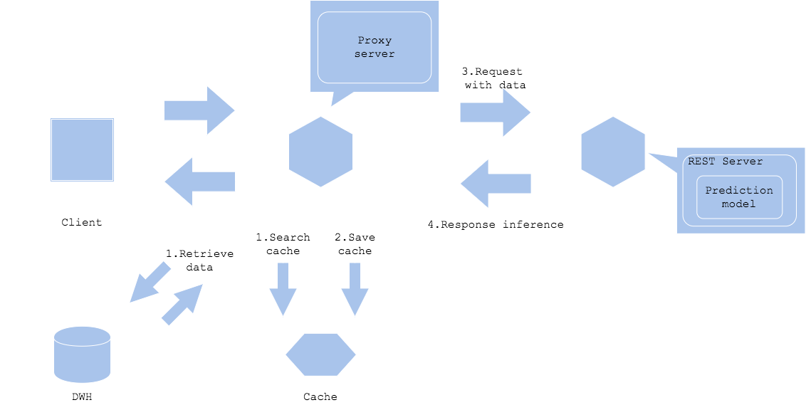
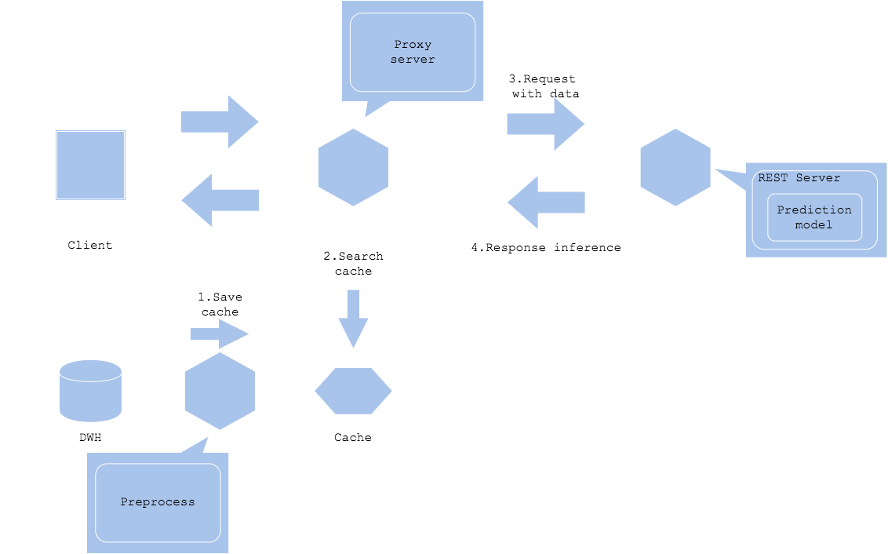

# Data cache pattern

## Usecase
- When you have prediction request for same and repeated data.
- When the data can be identified with cache key.
- When you want to accelerate data retrieval and processing.

## Architecture
The data cache pattern will cache input data. If the input data is stored in database, storage or disk, you will be able to shorten overhead of acquiring data. 
The amount of data to cache may need to be considered with balance of cost and volume. The unit price for cache space tends to be higher with less size than storage or database, hence it is recommended to plan a policy to clear cache. 
If the prediction result changes with time, it requires to clear old cache to prevent responding with outdated prediction. If the service gets high load that the cache size increases rapidly, it is important to plan cache clear policy concretely. In many cases, the cache gets cleared with time elapsed or request frequency of key. 
There are two architectures for the pattern.
1. Cache input data. In this case, the service will request input data to DWH and cache parallelly, and proceed to prediction request if cache hits. If not hit, then you will add the data into the cache along with requesting the prediction. You may cache the data after preprocess, to decrease load for preprocessing. 
2. Preprocess or cache before request. In this case, you will cache data prior to the prediction request, possibly along with the service's first data generation. Once you get a prediction request to the data, you will retrieve from cache to send to prediction. It is a good choice if you want to increase cache rate to improve latency.

## Diagram
### Input data cache

### Prepare data cache

## Pros
- To offload request to prediction server and improve performance.
- Able to respond quickly.

## Cons
- Cache server cost.
- Cache clear policy.

## Needs consideration
- The input data should be able to get identified with key.
- Tradeoff between speed, cost and volume.
- Cache clear policy.
- Data cache policy.

## Sample
https://github.com/shibuiwilliam/ml-system-in-actions/tree/main/chapter4_serving_patterns/data_cache_pattern
