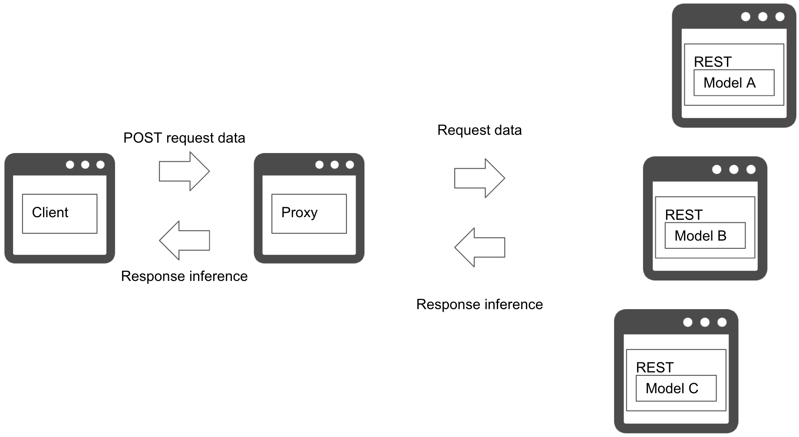
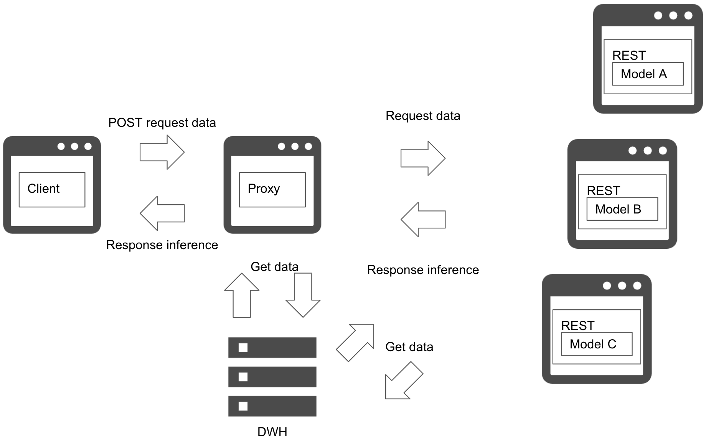
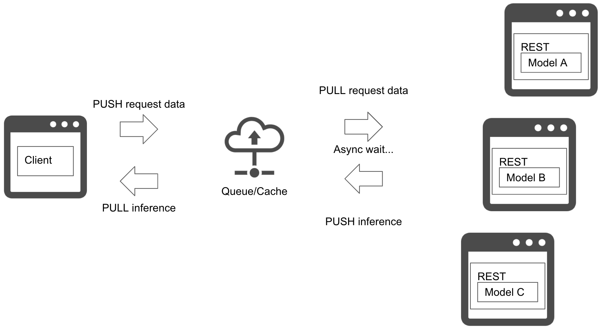

# Microservice horizontal pattern

## Usecase
- 依存関係のない複数の推論を平行して実行するとき
- 複数の推論結果を最後に集計するワークフローのとき
- 1データに対して複数の推論結果が必要なとき

## Architecture
依存関係のない複数の推論モデルを平行して実行するのが並列マイクロサービス・パターンです。並列マイクロサービス・パターンでは各推論サーバに平行して推論リクエストを送信することで、複数の推論結果を得ることができます。要件に応じて、複数の推論結果を集計することや、特定の推論結果のみをレスポンスすることも可能です。 
推論は用途によって同期的・非同期的に実行する方針を決める必要があります。同期的に実行するユースケースとしては、全推論を得てから結果を集計する場合が考えられます。非同期的に実行する場合は、推論を得たら即時にアクションを取るユースケースが考えられます（`Asynchronized horizontal`）。 
クライアントと推論サーバの間には推論を仲介するプロキシを置くことが可能です。プロキシを配置することでデータ取得や推論結果の集約等のタスクをクライアントから隔離することが期待できます。推論のための入力データはプロキシで一括して収集することも、各推論サーバで取得することも可能です(`Synchronized horizontal with data retrieval`)。前者のメリットはDWHやストレージへのアクセス回数を減らし、オーバーヘッドを削減できることです。後者のメリットは各モデルが必要なデータを取得することで、複雑なフローを実現することができます。

## Diagram
### Synchronized horizontal

### Synchronized horizontal with data retrieval

### Asynchronized horizontal

## Pros
- 推論サーバを分割することでリソース調整や障害分離が可能。
- 推論のワークフロー間で依存関係を持たせず、柔軟にシステムを構築することができる。

## Cons
- 複数の推論を稼働させるため、システムが複雑になることがある。
- 同期的に実行する場合、所要時間が最遅の推論に依存する。
- 非同期に実行する場合、推論器どうしの所要時間の差を後段のワークフローで吸収する必要がある。

## Needs consideration
- 推論を同期的に実行するか、非同期的に実行するか。
- 同期的に実行する場合、遅い推論をタイムアウトするか等の検討が必要。
- 非同期的に実行する場合、推論の所要時間差の検討が必要。

## Sample
https://github.com/shibuiwilliam/ml-system-in-actions/tree/main/chapter4_serving_patterns/horizontal_microservice_pattern
