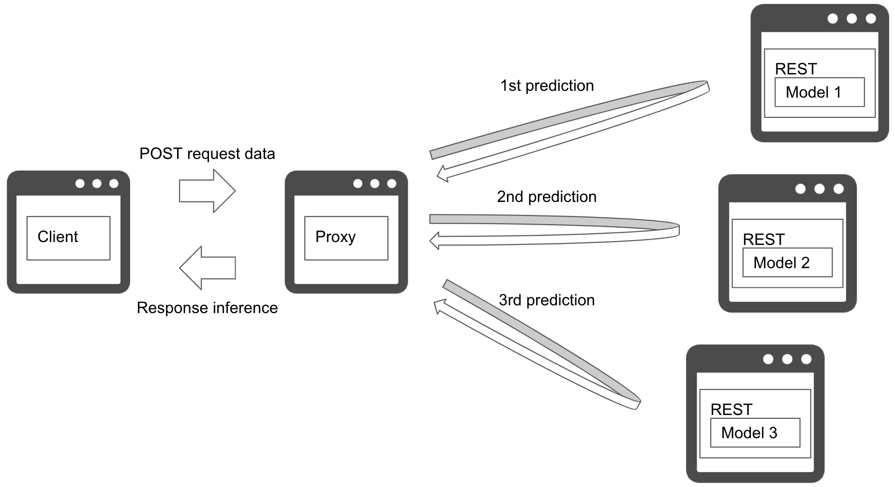
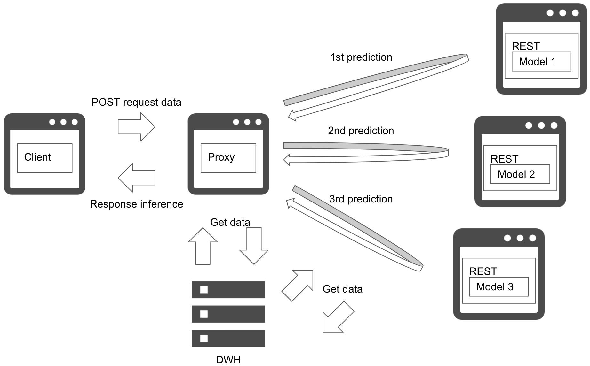

# Microservice vertical pattern

## Usecase
- 순서대로 여러 예측을 해야하는 경우
- 여러 예측이 있고, 예측끼리 의존 관계가 있는 경우

## Architecture
Microservice vertical pattern을 사용하면 여러 모델을 순서대로 실행할 수 있습니다. 이 패턴은 별도의 서버 또는 컨테이너에 예측 모델을 배포합니다. 예측 요청을 위에서 아래로 동기적으로 실행하고, 결과를 수집해 클라이언트에 응답합니다. 서로에 대한 순서 종속성이 있는 경우 마이크로서비스 수직 패턴을 선택하는 것이 좋습니다. 서버를 독립적으로 배포하기 위해 유지관리 라이프사이클과 장애 격리를 분리할 수 있습니다. 
클라이언트와 예측 서버 사이에 프록시를 둘 수 있습니다. 이 프록시 배치를 통해 클라이언트로부터 데이터 검색 및 예측 순서 제어 분리를 기대할 수 있습니다. 프록시나 각 예측 서버에 추가 데이터 검색을 할 수 있습니다(`Diagram2`). 데이터를 얻는 프록시의 장점은 오버헤드를 줄이기 이해 데이터 웨어하우스 또는 스토리지의 요청 수를 줄이는 반면, 후자는 복잡한 워크플로우를 만들 수 있는 각 예측 모델에 따라 데이터 구조를 제어할 수 있습니다.

## Diagram
### Diagram1

### Diagram2

## Pros
- 여러 예측을 순서대로 실행할 수 있습니다.
- 이전 예측 결과에 따라 다음 예측 서비스를 선택할 수 있습니다.
- 리소스를 효율적으로 사용하고, 서버와 코드를 독립하고, 장애를 격리할 수 있습니다.

## Cons
- 예측이 동기식으로 실행되므로 대기 시간이 더 필요할 것입니다.
- 이전 예측 지연으로 병목이 될 수 있습니다.
- 복잡한 시스템 구조와 워크플로우

## Needs consideration
- 필요한 서비스 수준을 만족하기 위해, 구체적인 성능 튜닝을 고려할 필요가 있습니다.
- 시스템 구조가 복잡해질 수 있기 때문에 인터페이스와 서버들을 공통화하는 것이 좋습니다. 
