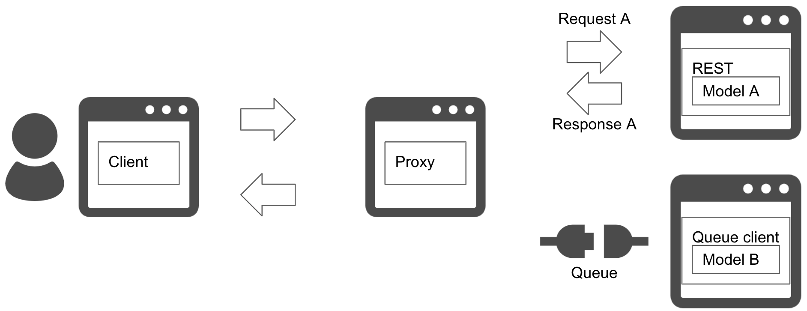

# Multiple stage prediction pattern

## Usecase
- 대화식 애플리케이션에서 머신러닝 예측을 사용할 경우.
- 하나의 목적에 가벼운 모델과 무거운 모델이 있는 경우.

## Architecture
Multiple stage prediction pattern은 워크플로우가 여러 단계로 클라이언트에 응답하는 경우 사용할 수 있습니다. 일반적으로 머신러닝 모델은 테이블 및 숫자 데이터를 사용할 경우 가벼운 경향이 있는 반면, 이미지나 텍스트 같은 비정형 데이터는 무거운 경향이 있습니다. 일부 서비스는 사용자 경험을 개선하기 위해 더 나은 예측을 추가해 빠른 응답을 요구합니다. 웹 애플리케이션은 속도와 정확도의 균형을 유지하는 것이 중요하며, 대화형 애플리케이션은 먼저 빠른 예측을 반환한 후 다음 화면 또는 아래쪽에 더 좋은 예측을 추가하는 방법을 고려할 수 있습니다. 이 패턴은 대화형 애플리케이션에 효과적입니다.

 

이 패턴은 두 개의 예측 서버가 존재합니다. 하나는 빠른 동기식으로 응답하고 다른 하나는 나중에 비동기식으로 예측하는 서버입니다. 첫 서버는 REST 또는 GRPC 인터페이스를 사용해 무난한 정확도를 가진 예측을 빠르게 응답하는데 사용됩니다. 후자는 느리므로 비동기 대기열 또는 메세지 서비스가 유용합니다. 프러덕션 모델은 여러 형태를 사용할 경우 예를 들어 동기식 예측을 위한 수치 및 범주형 데이터, 비동기식 예측을 위한 영상과 텍스트 같이 사용될 데이터로 분리될 수 있지만, 예측 품질과 응답 속도의 요구 사항에 따라 달라집니다.

## Diagram

## Pros
- 빠르게 대응하고 그 후 더 잘 예측합니다.

## Cons
- 여러 서비스와 인터페이스가 필요합니다.

## Needs consideration
- 속도, 정확도, 유저 경험의 균형을 맞춰야 합니다.
- 무거운 예측을 제공하는 방법에 대해 고민해야 합니다.
