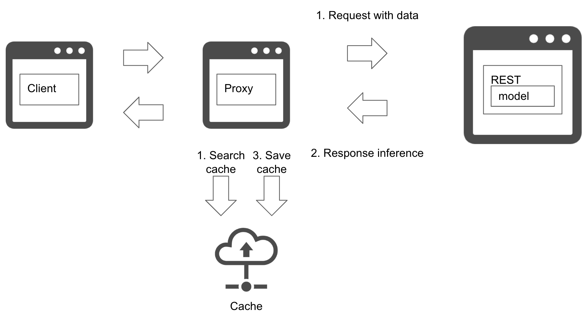

# Prediction cache pattern

## Usecase
- When your service may get prediction request on same data, and can identify it.
- The prediction result may not change so frequently.
- The input data can be searched with cache.
- To accelerate prediction and offload.

## Architecture
In the prediction cache pattern, you will store predicted result into a cache to make it possible to search for the later request for the repeated data. If your service gets requests for same data, and if it is possible to identify it is the same, you can get advantage of the pattern. 
The prediction server or proxy will store input data as cache key with prediction as value, if the key does not exist. After the cache, the cache search and prediction will be executed parallelly and returns the value if the cache hits without waiting for the prediction completes. It will shorten the amount of time taken to predict with less load to the prediction server. 
The amount of data to cache may need to be considered with balance of cost and volume. The unit price for cache space tends to be higher with less size than storage or database, hence it is recommended to plan a policy to clear cache. 
If the prediction result changes with time, it requires to clear old cache to prevent responding with outdated prediction. If the service gets high load that the cache size increases rapidly, it is important to plan cache clear policy concretely. In many cases, the cache gets cleared with time elapsed or request frequency of key.

## Diagram
### Prediction cache 

## Pros
- To offload request to prediction server and improve performance.
- Able to respond quickly.

## Cons
- Cache server cost.
- Cache clear policy.

## Needs consideration
- The input data should be able to get identified with key.
- Tradeoff between speed, cost and volume.
- Cache clear policy.
  
## Sample
https://github.com/shibuiwilliam/ml-system-in-actions/tree/main/chapter4_serving_patterns/prediction_cache_pattern
