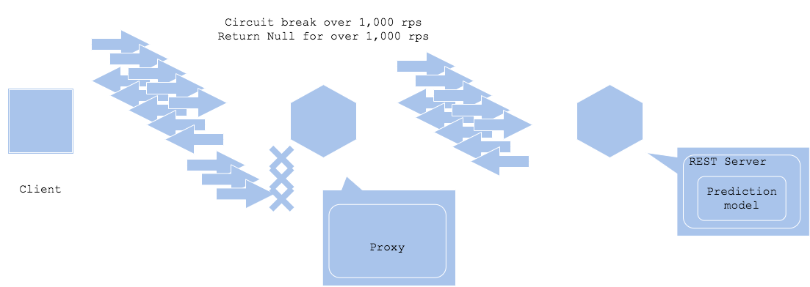

# Prediction circuit break pattern

## Usecase
- 推論へのアクセスが急激に増減する場合
- 急激なアクセス増減に推論サーバやインフラが対応できない場合
- 全リクエストへレスポンスを返す必要がない場合

## Architecture
Webサービスではキャンペーンや不慮の事件等によってアクセスが急激に増加することがあります。そうした場合、クラウドやKubernetesではスケールアウトすることによって増加したアクセスに対応することが可能ですが、リソースのスケールアウトよりもアクセス増のほうが急速に発生することが一般的です。特にモデルファイル等を含み、サーバやコンテナのイメージの容量が大きい傾向にある推論サーバでは、リソースの起動は時間を要する傾向にあります。 
推論サーキットブレーカー・パターンはリソース増加が完了するまでの時間、推論サーバを「全断」させないためのアーキテクチャーです。本パターンでは一定以上の頻度で発生するリクエストをプロキシで遮断することによって、推論サーバに送信されるリクエスト数を処理可能な量に制限します。サービスが全断する事態を最悪とすれば、一部のリクエストのみを遮断することでサービスを継続する、という発想です。高負荷によって推論サーバが停止、再起動する可能性を鑑みれば、既存の推論サーバは正常な状態を維持し、スケールアウトによって高負荷に耐える推論サーバ数になるまで一部のリクエストを遮断するのは、理にかなったアーキテクチャーになります。 
推論サーキットブレーカー・パターンを構成する際に重要なのは、遮断されたリクエストへのフォールバック・プランです。遮断されたことによってクライアントが停止し、後続のワークフローが破綻することは避けるべきです。遮断した場合のワークフローや注意書き等、アプリケーションを停止しない方法を用意することが重要です。

## Diagram

## Pros
- 負荷が急激に増加してもサービス全体を停止しない。
- 推論サーバを停止せず、安全にスケールアウトすることが可能。

## Cons
- 遮断された一部のリクエストに対するフォールバック・プランが必要。

## Needs consideration
- 遮断されたリクエストへのフォールバック・プラン。
- サーキットブレーカーの値が低すぎてほとんどのリクエストを処理できない場合は、そもそものアーキテクチャーやリソースを再検討する必要あり。
