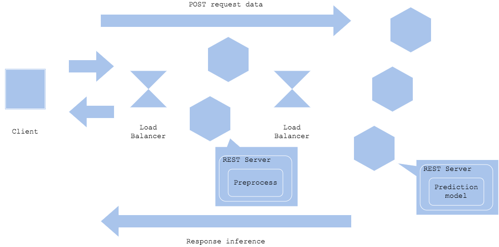
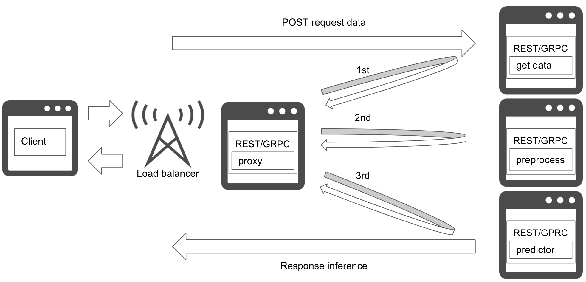

# Preprocess-prediction pattern

## Usecase
- 전처리 및 예측에서 사용하는 코드가 다른 경우, 라이브러리나 리소스의 요구 사항(requirements)가 있는 경우.
- 리소스의 이슈를 나누고 가용성을 향상시키기 위해 전처리와 예측을 분리하고 싶은 경우.

## Architecture
전처리 요구 사항과 예측 요구 사항이 다른 경우가 있습니다. 보통 전처리는 숫자 데이터의 normalization, standardization, 범주형 데이터의 one-hot encoding, NLP의 vocab filtering, 이미지 크기 조정 등을 실행하며, 프리트레인(pretained)될 수도 있고 룰 베이스로 실행될 수도 있습니다. 반면에, 예측은 예측을 반환하기 위해 입력을 받을 수 있는 프리트레인된 빌드나 바이너리화된 모델 파일이 필요합니다. 전처리는 Python으로 작성된 반면, 예측은 Tensorflow나 ONNX로 바이너리로 빌드하는 경우도 있습니다. 이러한 경우, 별도의 서버 또는 컨테이너를 구축해 각 리소스의 개발 및 운영을 최적화할 수 있습니다.  
전처리와 예측 모델을 별도의 리소스로 나누기 때문에 리소스에 대한 튜닝, 네트워크 연결, 버전화를 각각 고려해야 합니다. 이는 시스템을 [web single pattern](../Web-single-pattern/design_ko.md)보다 복잡하게 만드는 반면, 전처리-예측 패턴은 서빙 리소스를 효율적으로 사용할 수 있고, 독립적인 개발과 장애 격리(fault isolation)를 가능하게 합니다. 예측을 위해 딥러닝을 사용하는 경우 이 패턴을 적용하는 경우가 많습니다.  
`diagram2`는 전처리와 예측 앞에 프록시를 배치해 마이크로서비스로 만드는 모습을 보여줍니다. 이 경우 프록시는 데이터 검색, 전처리 및 예측 서비스를 중재합니다. 이 기능을 통해 독립적인 라이브러리, 언어 및 인프라를 별도로 개발할 수 있습니다. 그러나 장애 발생 시 문제 해결을 위해 모든 구성요소를 이해하는 관리 구성요소를 추가해야 합니다.

## Diagram
### Simple prep-pred pattern

### Microservice prep-pred pattern

## Pros
- 장애 격리로 리소스를 효율적으로 사용할 수 있습니다.
- 리소스 사용의 유연성 및 확장성.
- 구성 요소별 라이브러리 및 언어 버전 선택 가능합니다.

## Cons
- 리소스 복잡성으로 운영 비용이 증가합니다.
- 전처리와 예측 사이의 네트워크 연결이 병목이 될 수 있습니다.

## Needs consideration
- 전처리, 예측 등 모델 전체를 독자적으로 학습하는 것은 불가능하기 때문에 여전히 한 번의 학습에서 파라미터를 조정해야 합니다.
	- 전처리 및 예측을 별도로 개발하면, 예측이 부정확할 수 있지만, 시스템으로서 문제가 발생하지 않을 수 있습니다.
- 리소스를 각각 따로 관리해야 합니다.

## Sample
https://github.com/shibuiwilliam/ml-system-in-actions/tree/main/chapter4_serving_patterns/prep_pred_pattern
