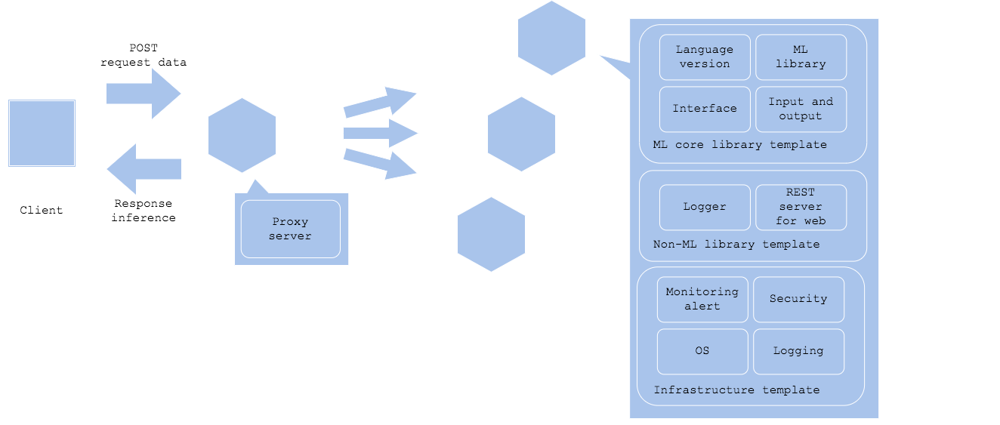

# Serving template pattern

## Usecase
- When you need to develop and release a tons of prediction serving with same input and output with common interface
- When you can standardize components in serving except for a prediction smodel

## Architecture
The prediction template pattern is to standardize prediction codebase, infrastructure and deployment policy as a reusable template. By standardizing the serving set, you gain profit of efficiency in development as well as release, and ability to share knowledge between multiple servings. When you are developing a system with multiple machine learning prediction models running, the team's productivity may get decreased if each serving has different architecture. It may happen if all the models take a separate interface, library, OS, and chipset, which is quite unusual, but if you can commonize (e.g. same Python3.x, Ubuntu18.0x, x86_64 architecture CPU, Nginx proxy, REST server with FastAPI, and scikit-learn and Keras models), making a reusable template is a good choise. In addition, by making interface for calling preprocess and prediction in common, you may be able to make an ideal template that just converting model file becomes a prediction server. 
The pattern enables standardizing common components and reusable. Its ideal template is the one that just by changing the model-specific paramenter in JSON or YAML to release the model. Even if you cannot make it standardized that far, you may try to standardize codebases other than model-specific preprocess and prediction to reduce the amount of coding. In addition, it is possible to commonize infrastructure layer, including monitoring, alert, logging, authorization, authentication and security. Even though it is probably difficult to provide a company-wide common template, you may consider step-by-step standardization; e.g. standardize infrastructure for company-wide, non-machine learning middleware for a team, and other components except for a model within a project. 
Note that you need consider template version update policy for the production servings. It is necessary to develop a template with backward compatibility. You may update the servings based on your service level. You may try updating the batch server in a timeframe the batch is not running. You may use the [online AB test pattern](../../QA-patterns/Online-ab-test-pattern/design_en.md) to update online services, such as REST server. If you cannot keep the backward compatibility, you may need to run the whole integration test before releasing to production. 
The last section lists step-by-step template level from infrastructure layer to machine learning model specific.

- Infrastructure: you may standardize without much consent on machine learning model, if the model require a specific chipset or runtime.
  - OS
  - network
  - authentication and authorization
  - security
  - logging
  - monitoring and alert
- Non-machine learning middleware and library: you may standardize with some consideration to ML model.
  - web server and job management server
  - logger library
  - REST server library and Protocol buffer with GRPC
- Machine learning library and language: require consideration.
  - language version
  - library version
  - interface
  - input and output

## Diagram

## Pros
- Able to improve efficiency
- Manage by a common policy

## Cons
- Updating the template require consideration and backward compatibility

## Needs consideration
- Backward compatibility and update policy
- Integration test

## Sample
https://github.com/shibuiwilliam/ml-system-in-actions/tree/main/chapter4_serving_patterns/template_pattern