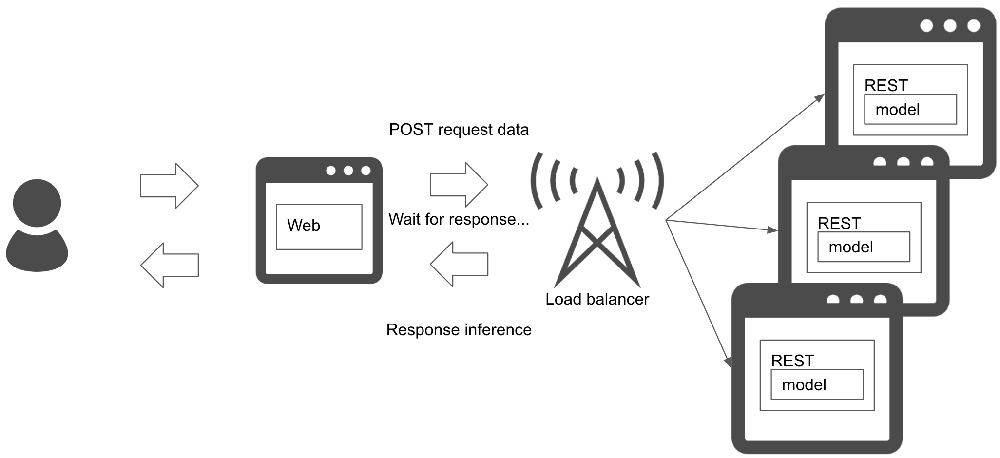

# Synchronous pattern

## Usecase
- 다음 단계를 진행하기 위해 예측의 결과를 받아야 하는 경우.
- 예측 결과에 따라 워크플로우가 달라지는 경우.

## Architecture
Synchronous pattern은 예측을 동기식으로 실행할 때 사용됩니다. 예측이 끝날 때까지 프로세스를 블락합니다. REST 또는 GRPC를 사용해 예측 서버를 개발하면 종종 동기 패턴이 됩니다. 간단한 단계별 워크플로우를 고려할 수 있는 가장 쉬운 패턴 중 하나입니다.

## Diagram

## Pros
- 아키텍처의 단순함으로 관리가 쉽습니다.
- 예측이 완료될 때까지 프로세스가 진행되지 않아서 서비스 워크플로우가 단순해집니다.

## Cons
- 예측 속도가 병목현상이 됩니다.
- 예측 지연으로 인해 사용자 경험이 악화되지 않도록 해결방법을 고려해야 합니다.

## Needs consideration
- 예측 대기 시간으로 인해 사용자 경험이 악화되지 않도록 노력해야 합니다.
- 대기 시간이 너무 길면 타임아웃이 필요합니다.

## Sample
https://github.com/shibuiwilliam/ml-system-in-actions/tree/main/chapter4_serving_patterns/synchronous_pattern
