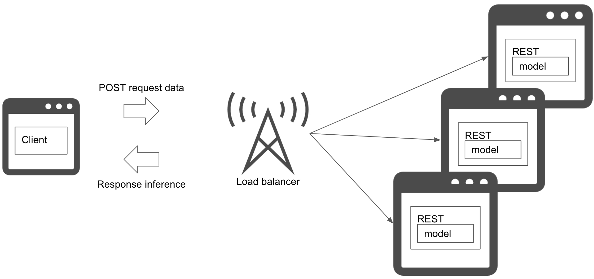

# Web single pattern

## Usecase
- もっともシンプルな構成で推論器を素早くリリースしたいとき

## Architecture
Webシングル・パターンはWebサーバにモデルを同梱させるパターンです。同一サーバにRESTインターフェイス（もしくはGRPC）と前処理、学習済みモデルをインストールすることによって、シンプルな機械学習推論器をつくることができます。 
複数台のWebサーバで運用する場合はロードバランサーを導入して負荷分散することができます。ただしインターフェイスをGRPCで実装する場合、クライアントロードバランサーを用意するか、L7ロードバランサーを使用する必要があります。 
Webシングル・パターンへのモデルの含め方は[モデル・イン・イメージ・パターン](../../Operation-patterns/Model-in-image-pattern/design_ja.md)、[モデル・ロード・パターン](../../Operation-patterns/Model-load-pattern/design_ja.md)のいずれも実現可能です。

## Diagram

## Pros
- Python等、同一プログラミング言語でWeb、前処理、推論を実装することが可能。
- シンプルな構成で運用が簡単。
- 障害発生時のトラブルシューティングが容易。
- 1モデルで同期的に推論を返すだけであればWebシングル・パターンを推奨。

## Cons
- REST実装や前処理が同一サーバやDocker imageに封入されるため、個別のコンポーネントを更新することができない。

## Needs consideration
- REST実装や前処理、モデルを変更する際の更新方針。
- 負荷増加時のWebサーバのスケール増減方法。

## Sample
https://github.com/shibuiwilliam/ml-system-in-actions/tree/main/chapter4_serving_patterns/web_single_pattern
