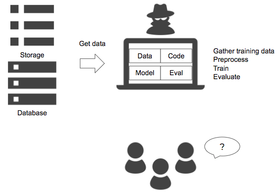

# Only-me pattern

## Case
- Condition when a ML engineer completes his/her task, including coding, data retrieval, model development, and evaluation, that others cannot review or reproduce the ML engineer's job.
- A ML engineer only provides a model without code and dataset, that nobody can run or evaluate it.

## Situation
It is common to develop a machine learning model using Jupyter Notebook in a private laptop. In order to deploy the model into a production system, you need to make an environment aligned with the development environment, including code, data and versionings of OS, language and libraries. If you can't, you may not be able to reproduce performance just as the dev. Also, there are libraries that have no compatibility among versions that just a minor version change may corrupt model execution, or change in performance. To avoid these cases, the ML engineers should share the development environment to the other engineers. 
In the only-me pattern, the ML engineer completes his/her tasks in the private environment that are dependent on it. To run the model in the production, it is necessary to reproduce the ML engineer's laptop. It makes a situation where it is needed to dump the environemnt configurations, which may get easily changed with an update. 
You need to develop application to be deployed to the production. An application or backend engineers can develop UI and API, though the ML portion, including data retrieval, preprocess and postprocess, require development or support of the ML engineer. To release to the production, it is recommended to have architecture and code review within the team.

## Diagram

## Pros
- ML engineer can develop in his/her favorite environment.

## Cons
- Difficult to reproduce model execution and release to production.

## Work around
- Have a common set of versions for OS, language and library among model development and production environment.
- Use of Docker or shared platform.
- Use of repository and code review.
  
## Related design pattern
- [Batch training pattern](./../../Batch-training-pattern/design_ja.md)
- [Pipeline training pattern](./../../Pipeline-training-pattern/design_ja.md)