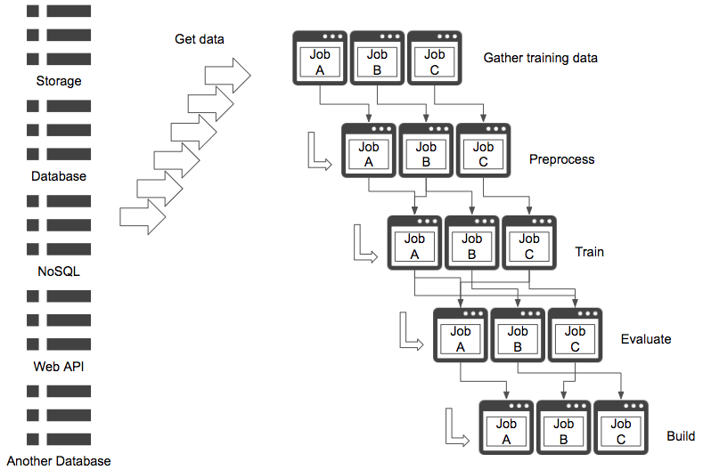

# Too many pipes pattern

## Case
- 一つの目的や学習のための学習パイプラインが多様且つ複雑な状態。
- データの取得元が多様且つ取得方法が適度に抽象化されていない状態。

## Situation
機械学習の学習パイプラインでは、学習だけでなくモデルのチューニングや実験、評価を行います。多様なパラメータチューニングや実験を同時並行で実行する場合、パイプラインも一本道ではなく多岐に渡るものになるでしょう。パイプライン内のジョブ間の依存関係がある場合は更に複雑化します。パイプラインがエラーで停止した場合の障害対応が発生し、パイプライン運用のためのSREが必要になるでしょう。社内システム基盤運用の一環として考えるならば機械学習の学習基盤運用は必須ですが、エラー箇所を局所化する、またはユーザビリティを向上させるために、パイプラインをシンプルに留めることは重要です。 
学習パイプラインを複雑化するもう一つの要因はデータアクセス方法が多様であることです。学習に使うデータが様々なDWH（RDB、NoSQL、NAS、Web API、クラウド、Hadoop、更には複数拠点等々）に格納されている場合、それらへのアクセス方法や認証認可は各々に定められています。各データ格納庫へのアクセスを抽象化するライブラリを使うことを推奨しますが、データが散らばっている状態はデータエンジニアの工数と健康に悪影響を与えるため、データを整理しておく（適切にDWHを選択する）ことが重要です。

## Diagram

## Pros
- 複雑なパイプラインによって多様な処理を実行することができる。

## Cons
- 運用が困難。

## Work around
- ジョブ間の依存関係はパイプライン構築時に制御できると良い。
- データは整理すること。

## Related design pattern
- [Batch training pattern](./../../Batch-training-pattern/design_ja.md)
- [Pipeline training pattern](./../../Pipeline-training-pattern/design_ja.md)