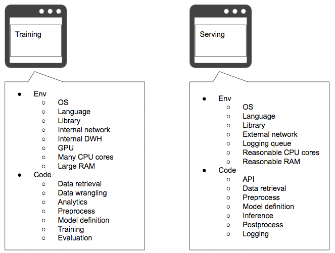

# Training code in serving pattern

## Case
- Code only used for training, experiment and evaluation is included in serving.
- Environment or configuration for training, experiment and evaluation is lest in serving.

## Situation
Code and logic for machine learning development, which includes training, evaluation, experiment and anything before release, are probably different from those for the production serving. Difference in code may be difference in dependent library. For instance, you will write data splitting, batch training, parameter tuning and so on in your training code, though you will rarely use them for serving. Having different logic and code for training and serving is one of the difficulties of implementing machine learning into production system. It is recommended to not include useless code in your production in order to limit update, isolate fault and simplify code reading. It is better not to include training specific code into your serving environment. 
Resources used for training, such as CPU, GPU, RAM, network and storage, might be different in those for serving. In web services, network and storage for training may be limited to internal, and those for serving will be open to public. For deep learning, use of GPU for training and CPU for serving, or use of training GPU and inference GPU, is very much common practice. For these reasons, the environment configurations for training may be unnecessary, or misconfiguration, for serving environment. It is acceptable if the configuration is not-used, though if it is applicable, it may cause an incident. 
On the other hand, it is rather needed to have some common codes and configurations between training and serving to maintain same performance, latency and accuracy. It is important ot distinguish what to separate and what to standardize.

- What to standardize between training and serving environment:
  - Versions of OS, language and library.
  - Code and logic used for inference, including preprocess, prediction and postprocess.
- What to separate:
  - Training specific code and logic.
  - Dependencies to training specifig library and resource, including training GPU, large amount of CPU and RAM, internal network and internal DWH.

## Diagram

## Pros
- For batch inference, you may be able to use the same environment for training and serving.

## Cons
- You need to take time to separate training and serving specific code and configuration.

## Work around
- Even if it is difficult to separate code and configuration for training and serving, recommended to at lease limit those related to cost, security and confidentiality, including network and data access.

## Related design pattern
- [Serving patterns](./../../Serving-patterns/README.md)
- [Training patterns](../README.md)