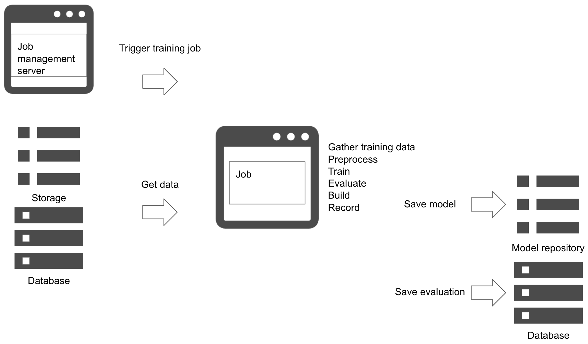

# Batch training pattern

## Usecase
- 배치로 학습시킬 경우.
- 배치 작업을 주기적으로 실행 시킬 경우.

## Architecture
머신러닝 모델을 정기적으로 학습시켜야 할 경우, Batch training pattern을 고려해볼 수 있습니다. 이 패턴에서는 배치 작업으로 학습을 정의하고 작업 관리 서버에서 정기적으로 실행될 수 있도록 설정을 해야 합니다. 배치 작업을 주기적으로 실행시키기 위해 Linux의 crontab을 사용할 수 있으며, 클라우드 서비스를 이용하거나 별도의 작업 관리 서버를 사용할 수도 있습니다.  
이 패턴은 오프라인에서 모델을 학습시키는 가장 일반적인 아키텍처 중 하나로, 워크플로우는 다음과 같습니다: 

1. 데이터 웨어하우스에서 데이터 수집(데이터 정제 작업이 필요할 수 있음.)
2. 데이터 전처리
3. 학습
4. 평가 
5. 예측 서버에 모델 구축
6. 모델과 서버, 평가 기록 

서비스의 목표 수준에 따라 각 단계에서 오류 처리를 어떻게 할지 고려해보아야 합니다.  
예측 모델을 매일 또는 매번 업데이트를 하는 경우(서비스의 요구 레벨이 높은 경우), 에러에 대하여 재시도 정책을 갖거나, 운영팀에 알람을 보내는 등의 정책을 정할 수 있습니다. 만약 업데이트가 꼭 지속될 필요가 없다면, 에러를 저장하거나 알림만 보내고 나중에 다시 처리할 수도 있습니다.  
실패한 작업에 대해서는 에러를 저장하고 로그를 통해 재처리 혹은 트러블슈팅을 하는 것이 좋습니다. 위의 워크플로우 1단계에서 데이터 수집 중에 잘못되거나 예상치 못한 데이터(예를 들어 Int 값에 Char 값, 잘못된 범위 등)가 들어올 수 있으므로 데이터 필터링 혹은 데이터 정제 작업이 필요합니다. 정상적이지 않은 데이터가 있다면 작업을 재실행하기 어렵습니다. 그러므로 데이터를 사전에 필터링하거나 수동으로 제외하는 작업을 해야 할 수도 있습니다.  
2단계부터 4단계에서 모델의 성능이 실제 서비스용으로는 부족할 수도 있습니다. 이러한 경우, 학습의 전처리 또는 하이퍼파라미터에 대해 재고하여 현재 데이터 세트에 맞게 튜닝할 수 있습니다. 
5와 6단계에서는 빌드 에러나 기록 에러 등 시스템 장애들을 고려해보아야 합니다. 이를 위해 시스템 구성 요소, 서버, 스토리지, 데이터베이스, 네트워크, 미들웨어 등을 검토하고 시스템 이슈의 근본적인 원인과 해결 방법 등을 찾을 수 있습니다. 

## Diagram

## Pros
- 정기적인 재학습과 모델 업데이트. 

## Cons
- 작업 에러 사항을 고려해야 합니다.
- 완전한 자동 워크플로우를 만들기 어렵습니다. 

## Needs consideration.
- 작업 관리 방법과 소프트웨어. 
- 에러 처리 방법. 

## Sample
https://github.com/shibuiwilliam/ml-system-in-actions/tree/main/chapter2_training/model_db