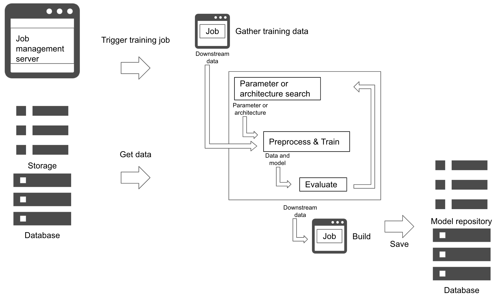

# Parameter and architecture search pattern

## Usecase
- To automatically search for parameter and architecture of a model.
- When manual tuning is difficult.

## Architecture
The parameter and architecture search pattern aims to design workflow to automate hyperparameter and architecture search. It is possible to search for the hyperparameter and architecture based on dataset and evaluation function to reduce manual task of model development. Hyperparameter is a parameter whose value is set before the learning process begins to control training criteria, such as depth of decisiontree, activation function in multilayer perceptron, etc. Common methods for hyperparameter search are grid search, random search, evolutionary algorithm, and bayesian optimization. Architecture is a overall structure of the model, such as inception and resnet in neural network. Common methods include neural architecture search in reinforcement learning and usage of gradient descent. In any methods, their aim is to search for an optimized machine learning model. 
The pipeline runs in a cycle of search, train and evaluate. You may use the pattern to be implemented in your model training process. The aim is to add the search mechanism, and make it possible to simultaneously optimize and train a model. It is necessary to configure parameters for the search in addition to training pipeline. Once you retrieved your training dataset, the training job will be executed with the parameters to search for a model and evaluate. Some search mechanism chooses next hyperparameter or architecture to train. The cycle completes depending on the number of loops, number of candidate parameters, time, or evaluation. Last but not least, be sure to record the model into your model repository. 
If there is a best practice for your purpose, or if it is well enough with transfer learning or retraining, the pattern is not the right choise. It is useful when you need to search or optimize for your specific problem.

## Diagram

## Pros
- Automatically tune a machine learning model.
- Possible to discover a model that could not be manually.

## Cons
- Needs parameter to search.
- Computational cost.

## Needs consideration
- Parameter search or architecture search.
- Algorithms for parameter search and architecture search.
- Parameters for the algorithm.
- Cost.