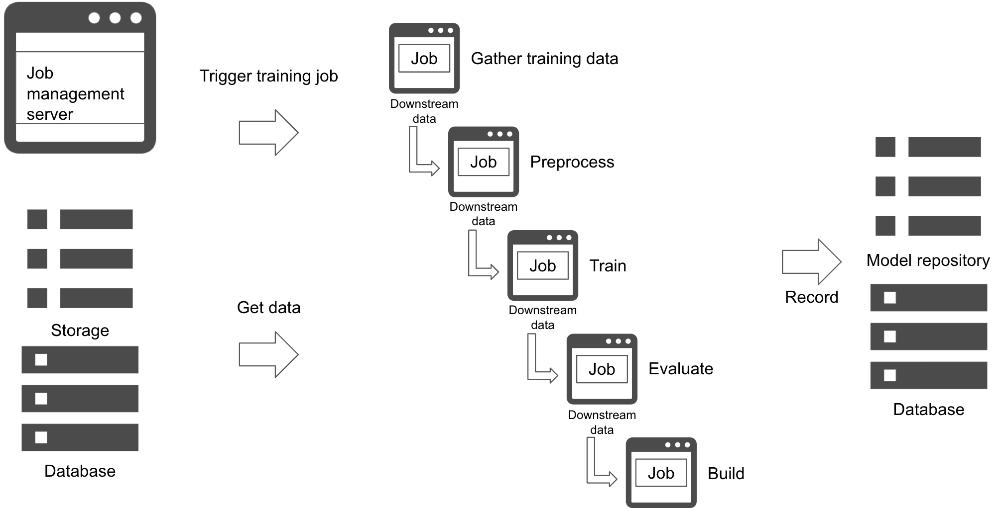

# Pipeline training pattern

## Usecase
- 学習パイプラインのリソースを分割し、各ジョブでライブラリ選定や流用を可能にしたいとき
- 各ジョブ毎にデータの状態や進行を記録し、リトライを簡単にしたいとき
- 各ジョブの実行を個別にコントロールしたいとき

## Architecture
パイプライン学習パターンはバッチ学習パターンの応用版です。各ジョブを個別のリソース（サーバ、コンテナ、ワーカー等）に分割することで、ジョブ・リソースを個別に構築することを可能にし、柔軟なりトライやジョブ実行を実現します。パイプライン学習パターンではジョブが個別リソースに分割されるため、依存関係にあるジョブの実行後に次のジョブ実行を可能にします。前ジョブの実行結果は後続ジョブに提供され、後続ジョブの入力データとなります。耐障害性のため、処理済みデータをDWHに格納することも可能です。前ジョブ完了直後に必ず後ジョブを実行する必要はありません。時間のかかる前ジョブの実行頻度を上げておいて、後段のジョブは低頻度で実行する、という構成も可能です。 
パイプライン学習パターンの難点は個別ジョブのリソース管理やコード管理等が複雑になることです。各ジョブの独立性を高める利点がある一方で、ジョブの実行条件やリソース選択等を個別に検討する必要があります。

## Diagram

## Pros
- ジョブのリソースやライブラリ選定等を柔軟に実施可能。
- ジョブのエラー箇所を分離しやすい。
- ワークロードやデータに応じた柔軟なジョブ管理が可能。

## Cons
- 各ジョブリソースの管理が必要になる。
- システムが複雑になる傾向にある。

## Needs consideration
- ジョブのリソース管理、ライブラリ管理、バージョン管理方法。
